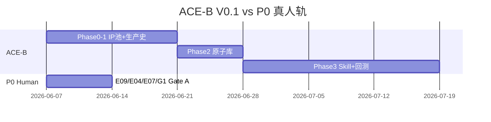

# ACE 全球 IP 专家蒸馏计划 · 执行路线图 V0.1 · 2026-06-07

> **Status**: ACTIVE · **首版可执行**  
> **North Star**: 6 周内交付 **ACE-B V0.1** + **A001 回测 PASS（有条件）**  
> **审议**: [`专家组审议_ACE复合专家体可行性_20260607.md`](./专家组审议_ACE复合专家体可行性_20260607.md) — **YES with conditions**  
> **命名**: `ACE-B_Sample_Visual_Production_Officer`（禁止 persona Agent）

---

## 0. 架构一览

```
Phase 0 对标 IP 池（8–12）
    ↓
Phase 1 IP 生产史还原（每 IP 1 卡）
    ↓
Phase 2 能力原子库 + 职业证据卡
    ↓
Phase 3 ACE-B V0.1 构建（6 周 sprint）
    ↓
Phase 4 A001 回测验收
    ↓
Phase 5 蒸馏卡 YAML 正典化
```

**并行轨（不受影响）**：P0 真人签核 — E04 · E07 · E09 · G1 · E25（送社前）· E20（Gate A 后）

| ACE 官员 | 阶段 | Gate | V0.1 |
|----------|------|------|:----:|
| ACE-A Canon_Gate_Officer | 正典 / Gate A | Gate A | 未建 |
| **ACE-B Sample_Visual_Production_Officer** | 样章视觉 | Gate A→B | **本路线图** |
| ACE-C Trial_Market_Officer | 试读 / 市场 | Gate C | 未建 |
| ACE-D Publishing_IP_Extension_Officer | 出版 / IP 扩展 | Gate D | 未建 |

---

## Phase 0 · 对标 IP 池（三层 · 8–12 个）

> 详表：[`ACE-B_对标IP池_初稿_20260607.md`](./ACE-B_对标IP池_初稿_20260607.md)

### 0.1 分层定义

| 层 | 定义 | 用途 |
|----|------|------|
| **L1 同形态** | 日本/全球桥梁书 · 儿童轻推理 · 五案单元 | 直接可迁移的生产环节 |
| **L2 相邻** | 同读者 band · 不同品类（ナゾトキ / 科学侦探 / 章书） | 单点机制借鉴 |
| **L3 跨行业** | 绘本/动画/杂志装帧 · 非图书形态 | 视觉生产 / 角色一致性 / 批次流程 |

### 0.2 IP 名单（10 个 · ACE-B 优先研究顺序）

| # | IP | 层 | ACE-B 研究阶段角色 |  rationale（一句话） |
|---|-----|:--:|-------------------|---------------------|
| 1 | **放課後ミステリクラブ**（知念·Gurin） | L1 | 卷首地图 UX · A 档跨页 · 彩色预算分配 | 日本同品类标杆；Gate A 竞品基线已有 |
| 2 | **Encyclopedia Brown**（Sobol） | L1 | 一案一图最小集 · 线索页布局 | C03 结构基因；图少但公平线索可见 |
| 3 | **A to Z Mysteries**（Roy） | L1 | 系列识别 · 册内节奏 · 章首图 | 五案单元 pacing 参照 |
| 4 | **Magic Tree House**（Osborne） | L1 | 章长/图面积比 · 固定 duo 构图 | 全球章书工业化模板 |
| 5 | **かいけつゾロリ** | L2 | 强符号 · 封面/内页风格一致性 | 日本系列视觉识别 |
| 6 | **ナゾトキ読本**（学研/ポプラ系） | L2 | 互动感 · 分步提示 UI（纸书适配） | 挑战感不学教辅形态 |
| 7 | **科学探偵 謎野真実** | L2 | 科学档案页 · 高销量插图密度 | 取密度不学恐怖 |
| 8 | **Geronimo Stilton**（Scholastic） | L2 | 版式活泼区 · 字体与图框 | 印前/系列化生产流程公开资料多 |
| 9 | **Moomin / 姆明**（Jansson） | L3 | 角色跨媒介一致性 · 温和比例 | 气质参照非画风 |
| 10 | **Pixar 分镜 / 艺术设定流程**（公开 BTS） | L3 | Shot 语言 · 色板 · 批次审阅 | 工业级视觉批次（非儿童尺度照搬） |

**公开知识源（非 persona · 写入蒸馏卡 knowledge_sources）**：

| 来源 | 类型 | ACE-B 提取 |
|------|------|------------|
| **石黒圭** | 装帧编辑 · 公开讲座/书籍 | 书衣与内页 **生产工序** · 编辑与设计师协作节点 |
| **北村薫** | 本格推理 · 公开访谈 | **公平线索** 在纸面上的 **可见性**（非文风） |
| **滝川洋二** | 视觉工艺 · 公开物料 | 批次审图 · 完稿检查清单（若指其他公开人物，卡内注明 ISBN/URL） |

---

## Phase 1 · IP 生产史还原模板（每 IP 1 份）

**路径**：`docs/ace-distill/ip_history/{ip_slug}_production_history.md`

```markdown
# {IP 名} · 生产史还原 · {date}

## 元数据
- ip_slug: 
- layer: L1|L2|L3
- primary_market: 
- source_refs: [ {type, url_or_isbn, date_accessed} ]

## 1. 产品形态
- 开本 / 页数 / 案结构 / 系列节奏

## 2. 生产流水线（还原）
| 阶段 | 输入 | 输出 | 周期（公开推断） | 关键角色类型 |
|------|------|------|------------------|--------------|

## 3. 视觉环节拆解（ACE-B 重点）
- 角色定稿节点
- 分镜/粗稿/精修/批次数
- 地图/线索页/跨页 决策点

## 4. 可蒸馏机制（3–7 条）
| 机制 ID | 描述 | 本项目映射 | 不学 |

## 5. 证据等级
- confirmed（官方/访谈）| inferred（行业通识）| speculative（标注不用）

## 6. Gate
- [ ] IP Owner 已读 §4 不学清单
```

---

## Phase 2 · 真人职业证据卡 + 能力原子库 schema

### 2.1 职业证据卡（真人顾问用 · 非 Agent）

**路径**：`docs/ace-distill/career_evidence/{role_slug}_evidence.md`

| 字段 | 说明 |
|------|------|
| role_type | 如「児童書装帧编辑」「桥梁书美术导演」 |
| public_profile | 公开履历摘要（不存私人联系方式） |
| portfolio_refs | 公开作品列表 ISBN/URL |
| decision_patterns | 3–5 条可观察判断模式 |
| boundary_quotes | 公开引用句 + 出处 |
| maps_to_E | E06 / E22 / G1 等 |

### 2.2 能力原子库 schema

**路径**：`docs/ace-distill/atoms/_schema/atom.yaml`

```yaml
atom_id: VIS-001
name: fair_clue_visible_in_frame
stage: gate_b_sample_visual
description: 关键线索在插图中可被 8-10 岁读者找到，不靠文字补述
sources:
  - ip: encyclopedia_brown
    mechanism_ref: ip_history/encyclopedia_brown_production_history.md#mechanism-3
  - knowledge_source:
      name: 北村薫
      type: public_interview
      ref: "…"
      usage: 线索公平性原则，非叙事风格
canon_priority: high   # high = 与正典冲突则丢弃本原子
ace_officer: ACE-B
check_type: lint|human_review
inherits: [V12, V13, P0-04, S18]
reject_if: ["q版主视觉", "恐怖氛围", "线索仅存在于口播"]
```

---

## Phase 3 · ACE-B V0.1 构建（6 周 sprint）

### Week 1 · 合规 + 池化 + 模板

| 任务 | 产出 | Owner |
|------|------|-------|
| W1.1 IP Owner 勾选四分离 S1–S6 | 审议 doc §五 更新为 ✅ | IP |
| W1.2 建目录 `skills/ace-experts/` + `_schema/` | 空结构 + distill_card.yaml | AI |
| W1.3 完成 L1 四 IP 生产史（放課後MC / Sobol / A to Z / MTH） | 4× Phase 1 md | AI + IP 抽检 |
| W1.4 从 A001 现有资产列 **差距表** | `ACE-B_A001_gap_matrix.md` | AI |
| W1.5 **不阻塞** Gate A：E04/E07/E09/G1 brief 照常发出 | 四栏回传追踪 | IP |

### Week 2 · 原子蒸馏 + Officer 章程

| 任务 | 产出 | Owner |
|------|------|-------|
| W2.1 L2 三 IP 生产史（ゾロリ / ナゾトキ / 謎野） | 3× Phase 1 md | AI |
| W2.2 石黒圭/北村薫/滝川洋二 → 3× knowledge_source 条目 | 并入 VIS-* 原子 | AI |
| W2.3 能力原子 ≥20 条（VIS / SHOT / DEPTH / G1 四类） | `docs/ace-distill/atoms/` | AI |
| W2.4 起草 `skills/ace-experts/ACE-B/SKILL.md` + CHARTER | Officer 权限上限 | AI + IP 审 |

### Week 3 · Skill 接线 + lint

| 任务 | 产出 | Owner |
|------|------|-------|
| W3.1 ACE-B Skill 调用 `academy-visual-auditor` 检查项 | 映射表 | AI |
| W3.2 `scripts/ace_distill_lint.py`（蒸馏卡字段/来源） | lint 可跑 | AI |
| W3.3 对 A001 Shot Map + depth 包跑 ACE-B 草案审计 | DRAFT 报告 | AI |
| W3.4 G1 PNG 回传后跑 **空间一致性** 检查 | 报告挂 E06 待签 | AI |

### Week 4 · 蒸馏卡 YAML 批量

| 任务 | 产出 | Owner |
|------|------|-------|
| W4.1 ≥8 张蒸馏卡 YAML（见 Phase 5 schema） | `skills/ace-experts/ACE-B/cards/` | AI |
| W4.2 L3 两源（Moomin + Pixar BTS）生产史 | 2× Phase 1 md | AI |
| W4.3 SC prompt 审计：禁 living artist style | FAIL 清单 | AI |
| W4.4 与 E22 五层排版交叉索引 | 无重复宪法 | AI |

### Week 5 · A001 闭环草案

| 任务 | 产出 | Owner |
|------|------|-------|
| W5.1 A001 六帧 depth 对齐 ACE-B 检查单 | 逐帧 PASS/HOLD | AI |
| W5.2 L0 lineup brief ↔ G1 ↔ SC prompt 三角对齐 | 三角对照表 | AI |
| W5.3 产出 **E06 待签包**（非代签） | PDF/MD 汇总 | AI |
| W5.4 Gate B kickoff brief A002 模板 | 复用 A001 路径 | AI |

### Week 6 · 回测 + 裁决

| 任务 | 产出 | Owner |
|------|------|-------|
| W6.1 A001 回测验收（Phase 4 标准） | 回测报告 | AI + IP |
| W6.2 四分离 S7–S8 补勾 | 审议 doc 更新 | IP |
| W6.3 IP Owner 裁决：扩 ACE-A / hold / 迭代 B | 1 页决议 | IP |
| W6.4 更新 [`专家库资源盘点_V1.0_20260607.md`](./专家库资源盘点_V1.0_20260607.md) ACE 注记 | 索引一致 | AI |

---

## Phase 4 · A001 回测验收标准

| # | 验收项 | 标准 | 证据 |
|---|--------|------|------|
| R1 | 蒸馏卡数量 | ≥8 YAML · lint 零 error | `ace_distill_lint.py` |
| R2 | 来源溯源 | 100% 原子 ≥1 公开出处 | 抽样 5 条 |
| R3 | 正典不冲突 | 与 V12–V14 / P0-04 / L0 brief 零 CRITICAL 冲突 | ACE-B 报告 |
| R4 | A001 Shot Map | 6 锚点全覆盖 · 每锚点 1 检查项 PASS 或 👤 例外登记 | Shot Map md |
| R5 | 公平线索 | depth 图 ≥3 张「线索可见」审计 PASS | visual-auditor 交叉 |
| R6 | 人格合规 | 零 persona Agent 名 · 四分离 S1–S8 全 ✅ | 审议 doc |
| R7 | 真人边界 | E04/E07/E09/G1 签字栏空白但 **包已齐** | E06 待签包 |
| R8 | 不学清单 | 每 IP 生产史 §4 至少 2 条「不学」已采纳 | IP 勾选 |

**回测 PASS 定义**：R1–R6 必达 · R7 允许 👤  pending · R8 IP 勾选

**回测 FAIL**：任一 CRITICAL 正典冲突未 HOLD · 或 S1–S6 未勾

---

## Phase 5 · 蒸馏卡 YAML schema

**正典路径**：`skills/ace-experts/_schema/distill_card.yaml`

见仓库内 schema 文件（字段说明 + 示例）。

**卡片实例路径**：`skills/ace-experts/ACE-B/cards/{card_id}.yaml`

---

## Gate · IP Owner 各 Phase 签批

| Phase | IP Owner 必须批准的内容 | 可并行 |
|-------|-------------------------|:------:|
| **0** | 对标 IP 名单 + 不学清单 | ✅ Gate A P0 |
| **1** | 每 IP 生产史 §4 机制 + §5 证据等级 | ✅ |
| **2** | 能力原子 `canon_priority: low` 批量（high 逐条） | ✅ |
| **3 W1** | 四分离 S1–S6 | ✅ |
| **3 W6** | A001 回测 R8 · ACE-A 扩建与否 | — |
| **4** | 回测 PASS 声明 | Gate B 可视 PASS 启动 |
| **5** | 蒸馏卡 schema 版本 LOCK | — |

---

## 并行轨 · P0 真人签核（ACE 不替代）

| 专家 | 截止建议 | ACE 可交付 | 👤 必须 |
|------|----------|------------|:-------:|
| E09 科学 P0-04 | 6/08 | 科学公平 lint 草案 | **签** |
| G1 画师 PNG | 6/13 前 | G1 brief 对齐报告 | **签** |
| E04 日文 | 6/13 | JP diff 表 | **签** |
| E07 文化 | 6/13 | 五维 HTML 结果汇总 | **签** |
| E06 L0 | Gate A | 六帧路径 + 审计 | **签** |
| E20 试读 | Gate A 后 | — | **组织** |
| E25 法务 | 送社前 | 素材溯源表 | **签** |



---

## 文件树（V0.1 目标）

```
skills/ace-experts/
├── _schema/
│   └── distill_card.yaml
├── ACE-B/
│   ├── SKILL.md
│   ├── CHARTER.md
│   └── cards/
│       ├── VIS-fair-clue-frame.yaml
│       └── …
docs/ace-distill/
├── ip_history/
├── atoms/
│   └── _schema/atom.yaml
└── career_evidence/
scripts/
└── ace_distill_lint.py
```

---

| 版本 | 2026-06-07 · V0.1 首版 |
| 关联 | [`ACE-B_对标IP池_初稿_20260607.md`](./ACE-B_对标IP池_初稿_20260607.md) |
