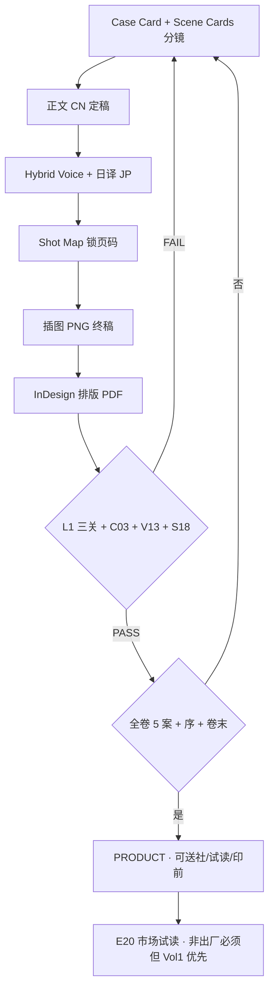

# Vol1 桥梁书 · 产品出厂验收标准 · V1.0

> **Status**: ACTIVE · **编辑 / 主编 / 美术 / 专家团 / Agent 共用**  
> **首市场**: 日本 · **形态**: 竖版 **桥梁书**（非 PPT · 非横翻漫画 · 非纯绘本）  
> **关联**: [`完整产品阶段交付包_V1.0.md`](./完整产品阶段交付包_V1.0.md) · [`创作标准与验收流程.md`](./创作标准与验收流程.md) · [`11_检查项Skill包_v0.1.md`](../00_项目概览/01_分支讨论_范式与框架/11_检查项Skill包_v0.1.md)

---

## 0. 三问定案（先对齐）

### Q1 · 每一案 = 一个完整小故事吗？

**是。** Vol1（方案 B）结构：

| 层级 | 是什么 | Vol1 数量 |
|------|--------|-----------|
| **卷** | 一本书《觉得奇怪，就先观察》 | 1 册 |
| **序** | 陸珣转学 · 观察社气质 · 非独立谜案 | 1 篇 |
| **案（单元）** | **一案一话** · 完整轻推理闭环（除案⑤ 卷级钩） | **5 案** A001–A005 |
| **卷末** | 陸瑆 **总笔记 1 篇** + 可选实验汇总 | 1 组 |

**不是**：一整卷只讲一个谜（那是方案 A 湿椅子 · C001 素材库）。  
**不是**：一案再拆成「章节」各讲半件事——案内 `### 1–4` 是 **同一故事的节拍**，不是 4 个故事。

---

### Q2 · 分镜头在哪里？为什么样张里看不到？

**分镜头 = Scene Cards + 插页地图（Shot Map）**，不是成品 PDF 里自动长出来的。

| 资产 | 已有路径 | 样张/PDF 是否含 |
|------|----------|-----------------|
| Scene Cards（五维场景卡） | `样章包/03_scene_cards_序+案01.md` | ❌ 未编入读者 PDF |
| 插页地图（页码×插图×叙事功能） | `样章包/06_插图brief_案01.md` · `13_试读PDF拼装说明.md` | 🟡 仅 p10 插 1 张 |
| 湿椅子卷完整范例（12 张地图） | `第1卷_总是湿的椅子/插图/插图布局与竞品规格_Vol1.md` | 参考 · 非 Vol1 正典 |
| **单案分镜头交付模板** | `样章包/00_单案分镜头交付模板_V1.0.md` | ✅ 本版新增 |
| **案① 分镜头+插页地图** | `样章包/03_案01_分镜头与插页地图_V1.0.md` | ✅ 本版新增 |

**结论**：逻辑在仓库里，**薄样张 P1 故意只交付「可读+试读」**，未交付 **排版级分镜表** → 出厂前必须补 **Shot Map 并锁页码**。

---

### Q3 · 最终出品长什么样？PDF 还是 PPT 还是电子书？

| 形态 | 用途 | 阅读方式 | 是否「给孩子读的书」 |
|------|------|----------|----------------------|
| **排版书籍 PDF**（A5/B6 竖版） | **主产品 · 试读 · 送社 · 印前** | 单页纵向翻页（**像纸质书**） | ✅ **是** |
| **InDesign/印刷文件** | 印厂 | 同左 | ✅ |
| **EPUB/电子书**（二期） | 渠道 | 竖 scroll 或 reflow · **非**横翻条漫 | ✅ 衍生 |
| **PPT 16:9** | 投资人/内部路演 | 横向幻灯片 | ❌ **不是**正文产品 |
| **HTML 试读** | 构建中间件 | 浏览器 · 可打 PDF | 中间态 |

**我们对标的是**：日本/华语 **桥梁书 + 轻推理单元** 的 **排版内页 PDF**（封面+版心+插图锚点+目录），**不是**上下刷的短视频分镜 PPT。

---

## 1. 竞品与品类规格（整理自项目正典 + 公开市场）

### 1.1 品类定义 · 桥梁书

| 来源 | 规格要点 |
|------|----------|
| 台湾书目局 / 桥梁书研究 | 25 开常见 · 约 3000–4000 字/册（低段）· **图文各半** · 字号大 · 图辅助叙事不抢戏 |
| 未来亲子 2025 书展论坛 | 文字为主、图辅助 · 结构/互动经编辑设计 · 过渡独立阅读 |
| 本项目 B2 | 单案 12–18 分钟 · **图约 30%** · 5–7 案/册 |

### 1.2 直接竞品（轻推理 / 科学观察）

| 作品 | 结构 | 插图 | 互动 | 我们差异 |
|------|------|------|------|----------|
| **Ron Roy · A to Z Mysteries** | 单册多案 · 册末钩 | 黑白/少量 | 读者可猜 | 我们 5 案合订 + 壁报钩 · 名古屋写实水彩 |
| **Donald Sobol · Encyclopedia Brown** | **一案一话** · 短闭环 | 少 | **公平线索** | C03b 对标 · 我们加科学+实验 |
| **知念実希人 · 放課後の機転探偵社** | 长篇单事件 + 章节 | **彩色跨页** · Q 版 | 挑战书/线索 | 我们零恐怖 · 非 Q 版主视觉 · 观察非侦探 |
| **謎野真実 · 科学探偵** | 事件编/解决编 | 偏怪谈 | 科学档案 | **零恐怖** · 孩子推理 · 见 `09_竞品/` |
| **神奇校巴 / 口袋神探** | 科普卡片/Q 版 | 高卡通 | 知识向 | 我们正文不卡片化 · 水彩校园 |

**内部详表**：`09_日本参考资料库/09_竞品与同类IP/竞品分析_推理科普童书.txt`  
**插图策略范例**：`第1卷_总是湿的椅子/插图/插图布局与竞品规格_Vol1.md`（12 张/48p 地图 · **机制可参考，卷目非 Vol1**）

### 1.3 我们 Vol1 定稿物理规格（出厂目标 · V1.1）

| 项 | 日本首市场目标 | 试读 P1 现状 |
|----|----------------|--------------|
| 主读者 | **小五小六 10–12 岁** · 四高年级兼容 | — |
| 开本 | **新书判** / 略大于文库 | A5 PDF 过渡 |
| 页数 | **144–160p**（Vol1）· 稳定卷 152–176p | ~20–30p（仅案①） |
| 正文日文字符 | Vol1 **32,000–38,000** | 🟡 样章远未达标 |
| 正文 | **日本語** · 句 20–35 字符 · 对话 35–45% | 🟡 JP 待 E04 |
| 插图 | 版式 **15–18%** · 每 8–12 页完整图 | 案① 4 张 🟡 |
| 卷 KPI | **读完率** > 厚重感 | ⬜ E20 |

---

## 2. 一本书的完整结构（Vol1 出厂形态）

```
[外封] 学堂奇事録 · 第1巻 · おかしいと思ったら、まず見てみる
[内封/版权] ISBN 位 · 试读声明（试读包）
[目录] 序 + 5 案标题（一眼见异常）
[序] 4月 · 転校 · 海报钩子
┌─ 案① めくれたポスター ─────────────────┐
│ 正文 JP │ Scene 插图 │ 线索卡 │ 瑆页(可选) │
└────────────────────────────────────────┘
┌─ 案② … 案⑤（⑤ 卷级钩 · 不结案）────────┐
│ 同上 + 尾钩窄条/壁报                      │
└────────────────────────────────────────┘
[卷末] 陸瑆总笔记 1 篇
[附录] 家庭实验汇总（可选）
[封底] 系列预告 · 观察社
```

**每个「案」在出厂验收里算 1 个 PRODUCT-UNIT**（见 §4）。

---

## 3. 发布逻辑（只有全部门禁过才是「产品」）



| 阶段 | 名称 | 能否对外称「书」 |
|------|------|------------------|
| 仅有 txt/md | 文稿 | ❌ |
| 仅有 Scene Card | 策划 | ❌ |
| 仅有 PNG | 美术素材 | ❌ |
| 薄样张 P1 PDF | **试读验证包** | 🟡 试读版 · 非卖品 |
| 排版 PDF 缺案 | 未完成 | ❌ |
| **§5 出厂表全 ✅** | **PRODUCT** | ✅ |

---

## 4. 单案（PRODUCT-UNIT）交付清单

**每一案 A00x 必须齐以下 7 层，缺一 = 该案未出厂。**

| 层 | 交付物 | 主责 | 路径规范 |
|----|--------|------|----------|
| **L1 策划** | Case Card | 系列主编 | `02_case_card_案xx_*.md` |
| **L2 分镜** | Scene Cards（≥4 场） | 轻推理编辑 | `03_scene_cards_*.md` 或案内分文件 |
| **L2b 插页** | **分镜头+插页地图** | 责编+美术 | `03_案xx_分镜头与插页地图_V1.0.md` |
| **L3 正文** | 中文 Hybrid Voice | 作者 | `04_案xx_*_HybridVoice.txt` |
| **L3b 日文** | JP 正文 | E04 | `04_*_日本語.txt` 或正本汇编 |
| **L4 视觉** | Prompt + PNG（按 Shot Map） | 美术总监 | `插图/prompts_V-Sxx.md` + PNG |
| **L5 互动** | 线索卡/实验（若该案有） | 责编 | `07_` / `12_` |
| **L6 排版** | 锁页码 spread 占位 | 版式 E22 | InDesign / `13_试读PDF拼装说明` 案内段 |
| **L7 门禁** | C03b/c/d · V13 · S18 · E07 | Agent+👤 | 11_检查项勾选 |

**案① 范例**：[`样章包/03_案01_分镜头与插页地图_V1.0.md`](../03_故事内容/第1卷_觉得奇怪就先观察/样章包/03_案01_分镜头与插页地图_V1.0.md)

---

## 5. Vol1 整册出厂验收表（PRODUCT-GATE）

**全部 ✅ 才可标 `PRODUCT_READY` 并进入发行讨论。**

### 5.1 内容与结构

| # | 检查项 | 标准 | Vol1 现状 |
|---|--------|------|-----------|
| P-01 | 5 案 + 序 + 卷末瑆笔记 | 方案 B 功能表 | 🟡 案①样章 · ②–⑤ 有稿 |
| P-02 | 每案 Scene Cards | ≥4 场/案 | ✅ 案① · 🟡 ②–⑤ |
| P-03 | 每案 Shot Map 锁页 | 页码+PNG ID | 🟡 案① 新增 · 未进 PDF |
| P-04 | 案⑤ 卷级钩 | C03c · 不结案 | ✅ brief |
| P-05 | 日语文体 | E04 全文 | 🟡 案① v1 · ②–⑤ 待 |

### 5.2 视觉与排版

| # | 检查项 | 标准 | Vol1 现状 |
|---|--------|------|-----------|
| P-10 | 封面/封底 | 品牌+卷名+主视觉 | 🟡 |
| P-11 | 目录 | 5 案可扫读 | 🟡 试读简目 |
| P-12 | 版心/字号/行距 | A5 · 11–12pt · 1.5 | 🟡 HTML/PDF 简排 |
| P-13 | 插图地图全卷 | A+B 双轨 · ~30% 图 | 🟡 v0.9 程序化 |
| P-14 | L0 角色一致 | V12–14 | 🟡 master 待 Nano |
| P-15 | 内页 PDF | 竖版 **PDF** 非 PPT | ✅ 展示版/薄样张 |

### 5.3 专家与红线

| # | 检查项 | 专家 | Vol1 现状 |
|---|--------|------|-----------|
| P-20 | C03 轻推理 | E05 | 🤖 案① |
| P-21 | 校园五维 | E07 👤 | ⬜ |
| P-22 | 日文母語 | E04 👤 | ⬜ |
| P-23 | 安全红线 | E13 · S18–20 | ✅ |
| P-24 | 试读 E20 | 组织者 | ⬜ 数据 |

### 5.4 构建可复现

| # | 命令 | 产出 |
|---|------|------|
| P-30 | `build_kid_trial_pdf.py` | P1 试读 PDF |
| P-31 | `build_expert_publication_pack.py` | P3 厚 PDF+PPT |
| P-32 | `audit_phase_package.py --all` | 文件存在性 |

---

## 6. 角色分工（编辑 / 主编 / 美术 / 专家）

| 角色 | 出厂前必须签字项 |
|------|------------------|
| **系列主编** | Case 功能 · 5 案结构 · PRODUCT-GATE 总表 |
| **责编** | Shot Map 页码 · 目录 · 线索卡文案 |
| **轻推理编辑** | Scene Cards · C03b/c/d |
| **美术总监** | 插图地图 · V13 · 封面 |
| **版式设计** | InDesign 母版 · 字体 · 出血 |
| **E04 日文** | 全书 JP |
| **E07 校园** | 田中五维 |
| **E20 试读** | 报告（**发布后**回流改稿） |

---

## 7. 当前交付物 vs 出厂标准（诚实对照）

| 你看到的 | 实际阶段 | 缺什么才算「书」 |
|----------|----------|------------------|
| **`样章包/PDF/*案01_完整单元书*.pdf`** | **完整单元书样张** | 5 案全文 · 全卷 Shot Map · E04/E07 签字 |
| **`第1卷_总是湿的椅子/PDF/*湿椅子_完整单元书*.pdf`** | **C001 形态参考** | 非 Vol1 · 仅证明出厂形态 |
| `薄样张_试读/PDF/*.pdf` | **P1 试读包** | 无分镜表 · 问卷为主 |
| `正式版/05_出版成果/*.pdf` | **P3 尽调厚包** | 同上 + 内页精排 InDesign · 插图终稿 |
| `*.pptx` | 路演 | **不是**儿童阅读产品 |
| `03_scene_cards_*.md` | **分镜策划** | 需升格为 `03_案xx_分镜头与插页地图` 并锁进 PDF |
| Scene PNG 若干 | 美术素材 | 需按 Shot Map 全量 + 统一画风 |

---

## 8. Agent 执行规则（与主编一致）

1. 用户要「一本书」→ 对照 **§5 PRODUCT-GATE**，缺项 **自动补**，不问「要不要分镜/封面」  
2. 交付时 **必须附完整文件夹路径**（见 [`完整产品阶段交付包_V1.0.md`](./完整产品阶段交付包_V1.0.md) §0）  
3. 分镜层交付物文件名：`03_案xx_分镜头与插页地图_V1.0.md`  
4. 试读 P1 ≠ PRODUCT；试读通过后 **才** 扩 P2/P3 排版深度  

---

最后更新：2026-06-05
