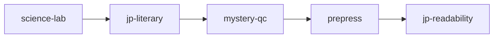

# 虚拟专家增补计划（优先蒸馏 Top 5）

> 日期：2026-06-07  
> 依据：[`专家库_全流程对标表_20260607.xlsx`](./专家库_全流程对标表_20260607.xlsx) 中 **⬜缺口** / **👤待签** 且阻塞 Vol1→试读→印前 的环节。  
> 范式：**田中みどり** — 角色型全网对标 + 可蒸馏 `academy-expert-*` Skill。

---

## 蒸馏优先级（P0，建议 2 周内）

| 序 | 虚拟专家名 | 蒸馏 Agent 名 | 对标角色型 | 为何先做 |
|----|------------|---------------|------------|----------|
| 1 | **佐藤健一** | `academy-expert-science-lab` | Gakken / 放課後MC 科学監修 | 正典科学表述、Gate B 实验页、试读理解度三线皆标缺口；Vol1 科学可信度硬门禁 |
| 2 | **吉田文子** | `academy-expert-jp-literary` | 日本児童文学雑誌編集 | 日版正典语感与 E04 阅读力学需母语儿文主编签核，当前仅 Agent 无签约编辑 |
| 3 | **渡辺理** | `academy-expert-mystery-qc` | Encyclopedia Brown 式公平谜题审 | 正典/Gate A/试读均需红鲱鱼与泄底扫描；补第三方谜题审的 Agent 化 |
| 4 | **鈴木版** | `academy-expert-prepress` | Scholastic / Geronimo 印前工程 | Gate B 版式 LOCK 后缺 CMYK/嵌入/分辨率验收，阻塞印前 |
| 5 | **小林由美** | `academy-expert-jp-readability` | 児童書レベル判定・试读主持 | Gate A 年级 band 与 JP 儿童 beta 为 👤待签；试读阶段无反馈闭环 |

---

## 每条蒸馏交付物（统一模板）

1. `.cursor/skills/academy-expert-<slug>/SKILL.md`（红线、输入/输出、检查清单、拒收条件）
2. 对标表对应行的 **当前状态** 从 ⬜/👤 → 🤖Agent（抽检保留 👤 签核位）
3. 与现有 Skill 边界：`academy-engine` 产稿，`academy-voice-editor` / `academy-jp-voice-editor` 润色，expert-* 只做 **验收/监修/模板**

---

## P1（Vol1 上市后 / Vol2+）

- `academy-expert-kids-marketing`（村上麻衣）— 腰封与试读钩子  
- `academy-expert-education-kit`（伊藤恵）— 教师侧观察任务单  
- `academy-expert-book-design`（鈴木版装帧向）— 与印前分工  
- `academy-expert-rights`（森田法务）— 素材与插画合同  

---

## 执行顺序建议

完成 P0 后回写对标表 **现有成员/Agent** 列，并在 [`专家库资源盘点_V1.0_20260607.md`](./专家库资源盘点_V1.0_20260607.md) 增补 E 映射注记。
