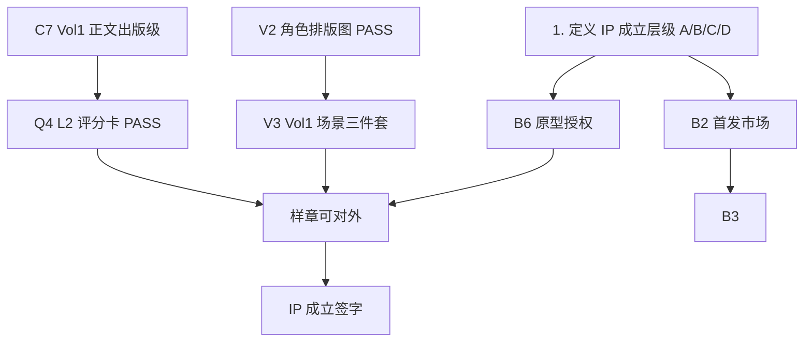

# IP 成立前置条件 · 讨论主稿

> **Status**: DISCUSSION OPEN  
> **开启日期**: 2026-06-04  
> **主持角色**: 总策划视角（`academy-series-architect`）  
> **读者**: 主编 + 创作/视觉/商业决策参与者

---

## 0. 为什么要开这个分支点

项目已从「创意阶段」进入「执行阶段」（见 `学堂奇事録_完整工作清单.md`），但 **「执行」≠「IP 成立」**。

当前状态是典型的 **「内容先行、成立标准未拍板」**：

- 正典层（人名、品牌、红线、Vol1 正文 v1.3）已大量锁定
- 视觉、50 卷大纲、对外商业路径、法律形态仍部分开放
- 若不在此分支明确「成立」定义，容易出现：一边批量写卷 / 出图，一边战略前提仍在漂移

**本分支的目标**：把「IP 成立」从模糊感觉，变成 **可勾选、可签字、可拒绝扩产** 的检查清单。

---

## 1. 先定义：「IP 成立」指什么？

请在讨论中 **三选一或组合**（可多层级并存）：

| 层级 | 定义 | 典型标志 | 当前倾向 |
|------|------|----------|----------|
| **A · 创作正典成立** | 世界观、角色、叙事规则、首卷样章达到「不可随意推翻」 | L0–L4 文档齐、Vol1 `READY_FOR_SAMPLE` | 🟡 接近，未正式签字 |
| **B · 产品样章成立** | 可对外展示的最小产品包（文字 + 图 + 实验页） | 样章 PDF / 送出版社或平台 | 🔴 视觉与统调未完成 |
| **C · 商业 IP 成立** | 可签约、可融资、可授权的品牌实体 | 商标、ISBN 路径、渠道验证 | 🔴 未启动 |
| **D · 法律实体成立** | 版权归属清晰、可维权 | 著作权登记、主体公司、合同模板 | ⚪ 未讨论 |

**开放问题 1**（主编拍板）：

> 我们说的「IP 成立」，最低要通过哪一层？A only？A+B？还是要到 C？

---

## 2. 前置条件总览（六维）

以下按 **创作 / 质量 / 视觉 / 资产 / 运营 / 商业** 六维展开。  
状态：**✅ 已满足** · **🟡 部分满足** · **🔴 未满足** · **⚪ 待讨论是否必要**

---

### 2.1 创作正典维（Creative Canon）

| # | 前置条件 | 状态 | 证据 / 缺口 |
|---|----------|------|-------------|
| C1 | 三语品牌名锁定 | ✅ | `00_项目总览/品牌名称定稿.md` |
| C2 | 10 角色姓名与团队成长线锁定 | ✅ | `人物名称定稿.txt` · 红线第三节 |
| C3 | 五条红线 + 九条原则 | ✅ | `创作红线与原则.txt` |
| C4 | 教室正典（4年2組 · 窗=校庭） | ✅ | `docs/world_reference/00_SCHOOL_CLASS_CANON_LOCKED.md` |
| C5 | 50 卷战略框架（阶段 I/II/III） | 🟡 | `50卷大纲与时间线.txt` 部分与正典不同步 |
| C6 | 双层叙事边界锁定 | ✅ | Vol1 世界设定决策已锁 |
| C7 | Vol1 正文达到出版级 | 🟡 | v1.3 存在；L2 评分卡 / 日译门禁未全 PASS |
| C8 | Vol2–3 卷任务包确认 | 🔴 | 大纲与工作清单中仍有旧设定残留 |

**开放问题 2**：

> C5、C8 是否列为 IP 成立的 **硬门槛**？还是允许「Vol1 样章先行、50 卷后补」？

---

### 2.2 质量门禁维（Quality Gate）

| # | 前置条件 | 状态 | 证据 / 缺口 |
|---|----------|------|-------------|
| Q1 | L1 三并列门（文化 / 环境 / 本格公平）文档齐 | ✅ | `docs/00_PROJECT_STARTUP_GATE.md` |
| Q2 | Project World Metrics 可执行 | ✅ | `docs/world_reference/` |
| Q3 | 田中みどり校准工具可用 | ✅ | `japan_campus_consultant_agent.html` |
| Q4 | Vol1 中文过 L2 评分卡（≥180，7.3≥7） | 🟡 | 评分卡 yaml / 语感决策记录待闭环 |
| Q5 | Vol1 日文过 J1–J7 全文督查 | 🔴 | `READY_FOR_TRANSLATION` 未达成 |
| Q6 | Agent 流水线（architect→engine→voice→visual）可复跑 | 🟡 | Skills + lint 已有；Vol2 未验证 |

**开放问题 3**：

> IP 成立是否 **必须** 含日文版？还是中文样章先行、日文作为日版立项条件？

---

### 2.3 视觉与品牌维（Visual & Brand）

| # | 前置条件 | 状态 | 证据 / 缺口 |
|---|----------|------|-------------|
| V1 | 插画风格规范 v2 锁定 | 🟡 | `13_插画风格规范_v2.md` — 统调进行中 |
| V2 | L0 十人身高四季排版图 PASS | 🟡 | CHAR_lineup L0–L4 有进展；举牌文案手改中 |
| V3 | Vol1 核心场景三件套（教室/座位/窗边） | 🔴 | Phase 2 待主编拍板 |
| V4 | 4年2組 透视基准图 | 🔴 | `10_VISUAL_SCENE_MASTER_BRIEF.md` 标明下一项待拍板 |
| V5 | 陸瑆笔记层 vs 正文层视觉分界 | 🔴 | 工作清单 C-1 待决 |
| V6 | 对外 Logo / 书封体系 | 🔴 | 命名已定，视觉未出 |

**开放问题 4**：

> 视觉维哪些是 **IP 成立** 必达？V2 only？还是 V1+V2+V3 全套？

---

### 2.4 知识与资产维（Knowledge & Assets）

| # | 前置条件 | 状态 | 证据 / 缺口 |
|---|----------|------|-------------|
| K1 | 09_ 参考资料库索引可用 | ✅ | `09_日本参考资料库/INDEX.md` |
| K2 | 200 篇 Case Card 体系 | 🟡 | `academy-story-database` skill 存在；填充度未知 |
| K3 | 原理去重表（50 卷不撞原理） | 🟡 | 大纲有框架，Vol1–10 细表未完成 |
| K4 | 竞品与同类 IP 分析 | ✅ | `09_竞品与同类IP/` |
| K5 | 实验页「你可以这样做」可复现验证 | 🔴 | Vol1 实验页文字未完成 |

**开放问题 5**：

> 「家庭实验可复现」是否上升为 IP 级承诺（对外营销话术）？若是，K5 升为硬门槛。

---

### 2.5 运营与工具维（Operations）

| # | 前置条件 | 状态 | 证据 / 缺口 |
|---|----------|------|-------------|
| O1 | 正典文件索引与 Agent 入口清晰 | ✅ | `CLAUDE.md` · `正典文件索引.md` |
| O2 | pre_push / volume_lint 可跑 | ✅ | `scripts/` |
| O3 | 讨论 vs 正典边界清晰 | 🟡 | 本分支即补此缺口 |
| O4 | 插图日语文案锁定流程 | 🟡 | Vol1 日语文案锁定 md 新建 |
| O5 | 版本归档规则（方案 A 等） | 🟡 | `00_归档/2026-06-03_方案A/` 有先例 |

**开放问题 6**：

> 运营维是否纳入「成立」定义？还是纯内部效率，不影响对外宣称 IP 成立？

---

### 2.6 商业与法律维（Business & Legal）

| # | 前置条件 | 状态 | 证据 / 缺口 |
|---|----------|------|-------------|
| B1 | 目标读者与市场（日 6–14 / 中 7–12）验证 | ⚪ | 产品定位文档 v2.0 在工作清单中引用，仓库内路径待核 |
| B2 | 首发市场（日本 / 中国 / 双语同步） | ⚪ | **未决 — 战略级** |
| B3 | 出版路径（自出版 / 传统社 / 平台连载） | ⚪ | 未讨论 |
| B4 | 著作权归属与作者署名规则 | ⚪ | 未讨论 |
| B5 | 商标（三语）申请策略 | ⚪ | 未讨论 |
| B6 | 真实人物原型（陸珣/陸瑆/葛西）授权与隐私 | ⚪ | **敏感 — 须早决** |

**开放问题 7**（可能一票否决）：

> B2、B6 是否必须在「任何对外样章」之前定案？

---

## 3. 依赖关系（讨论用）

**读图要点**：

- 不先定 **DEF（成立层级）**，后面 checklist 无法排优先级
- **B6（原型授权）** 若涉及真实儿童/家人，可能是法律一票否决项
- **样章可对外** 通常是 A+B 层级的交汇点，但不等于 C 层商业成立

---

## 4. 建议的三档成立方案（供讨论对照）

### 方案甲 · 「创作 IP 成立」（最小闭环）

**定义**：正典不可随意推翻 + Vol1 中文样章 + 核心视觉基准。

| 必达 | 编号 |
|------|------|
| 是 | C1–C4, C6, C7, Q1–Q4, V1–V2, K1, O1 |
| 可后补 | C5, C8, Q5–Q6, V3–V6, K2–K5, 全部 B* |

**适合**：先完成「这个 IP 是什么」，再谈市场和日版。

---

### 方案乙 · 「产品 IP 成立」（样章可送审）

**定义**：方案甲 + Vol1 统调插图 + 实验页 + 书封草案 + 原型授权清晰。

| 必达 | 编号 |
|------|------|
| 是 | 方案甲全部 + V3, V5, K5, B6 |
| 可后补 | Q5 日文, C5 50卷细表, B1–B5 |

**适合**：准备接触出版社、众筹或平台编辑。

---

### 方案丙 · 「商业 IP 成立」（可签约）

**定义**：方案乙 + 首发市场 + 出版路径 + 商标策略 + 至少 3 卷任务包。

| 必达 | 编号 |
|------|------|
| 是 | 方案乙全部 + B1–B5, C8（Vol2–3 任务包）, Q6 |
| 可并行 | Q5 日文版作为日版立项包 |

**适合**：融资、授权、 série 级合作。

---

## 5. 建议的讨论议程（可逐场推进）

| 场次 | 议题 | 产出 |
|------|------|------|
| **第 1 场** | 选定成立层级（§1）+ 三档方案（§4） | `01_决策记录.md` §1 |
| **第 2 场** | 创作/质量维：C5/C8/Q5 是否硬门槛 | `01_决策记录.md` §2 |
| **第 3 场** | 视觉维：V1–V6 哪些纳入成立清单 | `01_决策记录.md` §3 |
| **第 4 场** | 商业法律：B2/B6/B3 拍板 | `01_决策记录.md` §4 |
| **第 5 场** | 合成最终《IP 成立检查清单》→ 主编签字 | 升格至 `00_项目总览/` |

---

## 6. 当前仓库已锁定的「不可谈判项」（讨论时不重新打开）

以下视为 **已越过分支点**，本讨论仅引用、不推翻：

1. 三语品牌名（学堂趣事录 / 学堂奇事録 / The Curious Logbook）
2. 4年2組 · 窗=校庭
3. 核心团队 6 人上限、Vol1 陸珣入社
4. 零恐怖、本格公平、名古屋舞台
5. 私服 + 上履き（禁制服立绘）
6. 双层叙事结构（陸珣限知 + 陸瑆笔记）

若主编认为以上任一项应重开，应 **另开分支** 并标注「正典修订」，不与本分支混谈。

---

## 7. 本场可立即开始的三个问题

请主编（或参与者）先回应以下任意一项，即可推进第 1 场：

1. **成立层级**：你心中的「IP 成立」对应 §1 的 A / B / C / D 哪一层（或组合）？
2. **方案选择**：§4 的甲 / 乙 / 丙，哪一档最接近你的预期？需要第四档吗？
3. **一票否决**：§2.6 的 B6（真实原型授权）和 B2（首发市场），现在有没有倾向？

---

## 8. 关联正典（讨论时只读引用）

| 文件 | 用途 |
|------|------|
| `CLAUDE.md` | 项目入口与流水线 |
| `00_项目总览/创作标准与验收流程.md` | 单卷生产标准 |
| `docs/00_PROJECT_STARTUP_GATE.md` | 单卷 L1 门 |
| `学堂奇事録_完整工作清单.md` | 执行阶段任务 |
| `.cursor/skills/academy-series-architect/SKILL.md` | 总策划北极星 |

---

**下一步**：在 `01_决策记录.md` 记录定案 → 全部完成后关闭本分支并归档。

最后更新：2026-06-04
