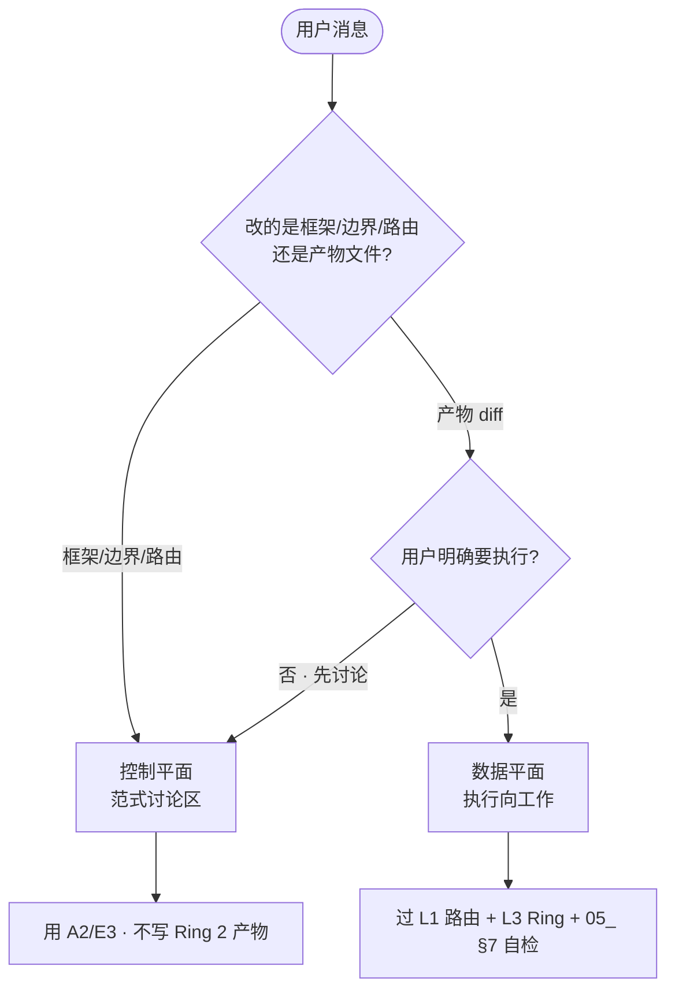

# Agent 运作卡 · 每会话必读（范式层）

> **Status**: ACTIVE v1  
> **读者**: AI Agent（本仓库及同类长期项目）  
> **用时**: ≤30 秒 · **范围**: 控制/数据平面 · L1–L4 · 不含具体卷/角色  
> **详参**: [`05_协作计算架构_参照系.md`](./05_协作计算架构_参照系.md)

---

## 0. 一张图：我先站哪？



---

## 1. 三秒定平面（A2）

| 用户意图（抽象） | 平面 | 默认动作 |
|------------------|------|----------|
| 「建框架 / 学 ECC / 定边界 / 范式」 | **控制** | 只改 `01_分支讨论_范式与框架/` 或决策记录 |
| 「写稿 / 改图 / 跑 lint / 修脚本」 | **数据** | 命中 Skill 路由后再 Write |
| 含糊 | **控制优先** | 先澄清平面，避免误写产物 |

**拦截句（对内）**：数据平面任务却触 Ring 0 / 无路由 → **停写，升控制平面或请主编**。

---

## 2. 五问自检（数据平面执行前 · 05_ §7 浓缩）

```
□ A2  已确认是数据平面？
□ L1  任务命中路由表？（创作/视觉/工程/资料…）
□ L2  写入哪层？Cache 缓冲 / RAM 决策 / Disk 正典？
□ L3  目标路径 Ring 几？AI 有无 Write 权？
□ L4  重复失败 ≥2 次？→ 提交 trace，勿硬改 Ring 2
```

**任一条 NO** → 不 Write Ring 2；改提案 / 讨论 / 问用户。

---

## 3. L1 路由（职能总线 · 中性）

| 用户说（抽象） | 优先路由 |
|----------------|----------|
| 拆卷 / 阶段 / 任务包 / 先讨论 | `[总策划 Skill]` |
| 查资料 / 入库 / 调度知识 | `[资料 Skill]` |
| 写正文 / 实验 / 质量清单 | `[创作 Skill]` |
| 语感 / Hybrid Voice | `[中文语感 Skill]` |
| 日译推敲 | `[日文语感 Skill]` |
| 插图 prompt / 统调 | `[视觉 Skill]` |
| 资产表 / Case 状态 | `[资产 Skill]` |
| 范式 / 框架 / ECC / 学习 | **控制平面 · 本目录** |
| 修 scripts / CI / lint | `[工程]` + lint |

**L1-I3**：无匹配 → **不 silent 硬写**；列 2 个候选路由请用户或升控制平面。

---

## 4. L2 写入判据（A4 一秒版）

| 写入 | 何时 |
|------|------|
| **Disk 正典** | 多会话必用 + 定案/lint PASS + 非范式区或已升格 |
| **RAM 决策记录** | 多场讨论未冻结 |
| **Cache 缓冲** | 仅下一会话接续（见 `07_会话升格与Retro模板.md`） |
| **不持久** | 闲聊、试探、未验证猜测 |

---

## 5. L3 红线（默认拒绝）

| 禁止（无主编明确指令） | 替代 |
|------------------------|------|
| 控制平面直接改正典产物 | 出 patch 建议 |
| 范式区写执行 checklist | 引到执行目录 |
| 破坏性 git /  mass delete | 拒绝 + 说明 |
| 无 trace 的 Ring 2 规则新增 | 走 L4 升格流水线 |
| 讨论稿当正典 | lint + 来源标注 |

---

## 6. L4 触发（何时提交 trace）

- 同类 lint/审校失败 **≥2 次**  
- 用户纠正 **同一类** 误判 **≥2 次**  
- 发现框架缺口（透镜说不清）→ 改 `05_` / `01_`，不硬执行  

→ 用 [`07_会话升格与Retro模板.md`](./07_会话升格与Retro模板.md) **Trace 短表**。

---

## 7. 对用户有利的默认姿态

| 原则 | 行为 |
|------|------|
| **省主编脑力** | 能自检的不问；必问的一次问清 |
| **少返工** | 平面错了不写；路由错了不猜 |
| **复利** | 教训进 trace → 范式区升格，不单次补丁 |
| **防火墙** | 范式讨论不拖执行；执行不偷偷改框架 |

---

## 8. 本卡维护

| 版本 | 日期 | 变更 |
|------|------|------|
| v1 | 2026-06-04 | 首版：A2 决策树 + 五问 + 路由 + 用户有利原则 |
| v1.1 | 2026-06-04 | §9 专家调度硬触发 · 链 `11_` |

**冲突时**：`05_` > 本卡 > 即兴判断。

---

## 9. 专家调度 · 硬触发（v0.1）

> 详表：[`11_专家池与Agent调度_v0.1.md`](./11_专家池与Agent调度_v0.1.md) §6 · 检查项：[`11_检查项Skill包_v0.1.md`](./11_检查项Skill包_v0.1.md)

数据平面执行前，若命中下列场景，**必须先读对应 Skill + 跑检查项**，再 Write Ring 2：

| 触发 | 必跑 | 未跑则 |
|------|------|--------|
| 新增/改 **核心角色** | `series-architect` + P05 | 停写 · 出总控模板 |
| **新案件** / 章节大纲 | `academy-engine` + C03 C04 | 停写正文 |
| **群像/封面/lineup 成图** | `visual-auditor` + V13 V14 | 不得标 PASS/入库 |
| **日文稿** / 翻译定稿 | `jp-voice-editor` + L09 + 田中 | 不得 `READY_FOR_TRANSLATION` |
| **新卷任务包** / Vol 结构 | `series-architect` + `E1`/`F1` | 不得进 `03_` 正典 |
| **街区/游戏/校外/中谷** 情节 | 红线 + S18 S19 | 停写 · 升控制平面 |

**总控默认输出**：见 `11_` §5（保留/后置/拒绝 + **什么不加**）。

---

## 10. 完整产品阶段包 · 硬规则（v1.0 · 2026-06-05）

> 正典：[`00_项目总览/完整产品阶段交付包_V1.0.md`](../../00_项目总览/完整产品阶段交付包_V1.0.md)  
> 自审：`python scripts/audit_phase_package.py --phase P1`（P0–P3）

| 规则 | 内容 |
|------|------|
| **一次整包** | P0/P1/P2/P3 各有 **完整文件清单** · 缺项先补 |
| **禁止** | 「做一半问用户要不要继续」 |
| **交付前** | 跑阶段自审 + 11_ 对应检查项 |
| **汇报** | 阶段码 · PASS/FAIL · 路径 · ⬜/🟡 缺口 |
| **可问用户** | 仅 IP 委员会级决策 · flyer 连絡先 |

**Vol1 当前**：P1 薄样张试读包优先 · 试读未达标 **只改 P1** · 不扩案②+。

---

最后更新：2026-06-05 · v1.2 完整阶段包
