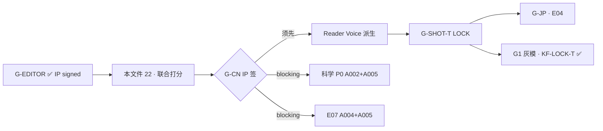

# V2 单元1 五案 · 专家组 + 读者群联合打分 · V0.1

> **分工**：**定量分见本文件（22）** · **定性好坏见 [`23_评分口径说明与逐案好坏清单_V0.1.md`](./23_评分口径说明与逐案好坏清单_V0.1.md)**  
> **日期**：2026-06-08  
> **对象**：V2.0 第一单元 A001–A005 · `正式版/01_正文/案0X_*_HybridVoice_V2.0.txt`  
> **口径**：**G-EDITOR 工作稿**（EDITOR 轨 · 含 `### SC-XX` / `【FC-N】` / 文件头元数据）· **非** Reader 层 · **非** G-CN LOCK  
> **方法**：专家组结构化审计 + 读者群模拟试读 · **非** 真实 E20 人类招募  
> ** supersede**：本文件 **整合并 supersede** [`18_读者群试读打分_对照真人评估_V0.1.md`](./18_读者群试读打分_对照真人评估_V0.1.md) 的分案打分表 · 18 仍保留 verbatim 摘录与完成度双轨 §4  
> **关联**：[`09_专家组裁定_五案锋利化_V0.1.md`](./09_专家组裁定_五案锋利化_V0.1.md) · [`10_五案字段级对照表_V0.2.md`](./10_五案字段级对照表_V0.2.md) · [`00_GPT_LOCK补丁_专家组复评_V0.1.md`](../正式版/01_正文/00_GPT_LOCK补丁_专家组复评_V0.1.md) · [`17_真人编辑评估回应_专家组_V0.1.md`](./17_真人编辑评估回应_专家组_V0.1.md) · [`19_综合整改意见_真人+读者+专家组_V0.1.md`](./19_综合整改意见_真人+读者+专家组_V0.1.md)

---

## §0 方法

### 0.1 专家组（五席 · 1–10）

| 席位 | 主审维度 | 本表映射列 |
|------|----------|------------|
| **叙事**（轻推理编辑） | 钩子 · 公平线索 · 情绪/洗冤 · Hybrid Voice（EDITOR 轨） | 钩子 · 公平线索 · 情绪/洗冤 · Hybrid Voice |
| **科学**（机制顾问） | P06 可跟做 · FC 与机制一致 · 人类签核状态 | 科学可验证 |
| **E07**（校园文化） | 名古屋校园 · 室内鞋/公开日/失物柜/预展礼仪 | JP/校园自然度（预判） |
| **E04**（日译预判） | 句长 · 对话比 · 术语日文化难度 | 并入 JP/校园 · 日译风险备注 |
| **E06**（分镜/视觉） | SC 对齐 Shot Map · 深度锚点可画性 | 并入 Hybrid Voice · FC 可见度 |

**专家组案综合** = 上表六维 **算术均**（不含术语污染；生产场标在 EDITOR 轨 **不扣分** · 在 Reader 交付 **另计**）。

### 0.2 读者群模拟（1–10）

| 角色 | 画像 | 权重 |
|------|------|:----:|
| **R1** | 五年级男生 · 推理漫画 | 1 |
| **R2** | 六年级女生 · 科学实验 | 1 |
| **R3** | 四年级男生 · 桥梁书下限 | 1 |
| **P1** | 家长伴读 | 1 |
| **T1** | 小学教师 | 1 |

**读者维度**：钩子 · 公平 · 情绪 · 可读 · 术语污染（`SC-`/`FC-`/`EXPERT_LOCK`/文件头/尾栏 production 字段）。

**读者群均（映射列）**：钩子/公平/情绪 → 同名列；**可读** → 表中 Hybrid Voice 读者代理；**科学** → R2「想回家试」+ T1「需成人解释」综合；**JP/校园** → T1 可信度；**案综合** = 五读者维均 **扣术语污染 0.5 分**（沉浸损失）。

### 0.4 全球 IP 表层 · H/C/S（增补 · doc37）

> **来源**：真人专家 2026-06-07 · [`37_全球IP表层标准_幽默可爱简单_V0.1.md`](./37_全球IP表层标准_幽默可爱简单_V0.1.md)  
> **方法**：R16 自评 + `score_global_ip_surface.py` · **cap 8** · **≠ G-BODY PASS** · 真实 E20 **0/12**

| 维度 | 代号 | 测什么 | E20 探针 | 读者群问法（镜像） |
|------|:----:|--------|----------|-------------------|
| **幽默** | H | running gag · ~800字/笑 | **E20-H1** | 「你笑了吗？哪里最好笑？」 |
| **可爱** | C | 渴望+缺口+可画 · mascot | **E20-C1**（可选） | 「你最喜欢谁？他/她哪里有意思？」 |
| **表层简单** | S | 150字 hook · ≤4 人 · 无剧透 | **E20-04** 续读 | 「开头就懂了吗？会不会乱？」 |
| **想加入** | J | 观察社空间 | **E20-J1** | 「你想加入观察社吗？为什么？」 |

**硬规则**：本表 **不并入** 案综合 7.9/7.1 · 记入 `scores_mvp_latest.json` · `global_ip_surface_self` · 与 `global_ip_expert` 并列。

### 0.5 E20 真实试读 · 16+12 题映射（A001 · doc 47）

> **SSOT**: [`薄样张_试读/A001_E20/`](../薄样张_试读/A001_E20/00_README_索引.md) · [`47_专家组_E20与M1M2_审读维度增补_V0.1.md`](./47_专家组_E20与M1M2_审读维度增补_V0.1.md) · **0/12 前不 claim PASS**

| E20 ID | 孩子 Q | 家长 P | doc 22 维度 | 通过线 |
|--------|:------:|:------:|-------------|:------:|
| **E20-H1** · M1′ | ★Q6 | — | H 幽默 | ≥60% |
| **E20-M2** · M2′ | ★Q2 | ★P4 | 科学可验证 | ≥60% |
| **E20-S1** · 强度—解脱 | ★Q7 | ★P6 | 情绪/洗冤 · **伦理护栏** | ≥70% · 任一しんどかった=红旗 |
| **E20-J1** · 想加入 | ★Q8 | — | J 想加入 | ≥60% |
| E20-04 · 续读 | Q3 | — | S 表层 / 钩子 | ≥70% |
| E20-C1（可选） | Q14 | — | C 可爱 | 分布观察 |
| fair-play 自推 | ★Q4 | — | 公平线索 | ≥50% |
| fair-play 回看 | ★Q5 | — | 公平线索 | ≥60% |
| 双层笔记 | ★Q9–Q12 | ★P8 | Hybrid/可读 | Q9≥50% · Q12≥40% |
| 写实 | ★Q15 | ★P7 | JP/校园 | ≥70% · P7≥4 |

**伦理护栏**（试读包 §0）：误指/排斥情节若孩子**真实不适** → 立即暂停 · 孩子感受 > 数据 · 见 [`A001_E20/01_伦理与知情同意.md`](../薄样张_试读/A001_E20/01_伦理与知情同意.md)

### 0.6 E20 审读分工（谁审什么）

| 角色 | 主审 | 交付 |
|------|------|------|
| 叙事 | M1′ 节奏 · 双层笔记 · fair-play | doc 23 定性 |
| 科学 | M2′ 机制 · FC · P06 | Q2/P4 |
| E07 | 写实 Q15/P7 | 校园流程 |
| E04/田中 | 日文 Q/P · 笑点自然度 | 07_注意事项 |
| 读者群 R1–T1 | 16 题镜像 · P0 跳读 | E20 原话记录 |

### 0.3 与 GPT_LOCK 自评 9.8 的分工

| 口径 | 分 | 说明 |
|------|:--:|------|
| LOCK/规范合规（`00_GPT_LOCK`） | **9.8** | 场结构 · FC 标注 · EXPERT_LOCK 零冲突 · V1.1 字数 |
| **本文件 · 出版体验** | **专家 ~7.9 · 读者 ~7.1** | 含科学/JP 未签 · metadata 负担 · 儿童独立可读 ≈0 |

---

## §1 逐案打分表（A001–A005）

### A001 · 全班都听见了他的声音

| 维度 | 专家组 | 读者群均 | 说明（引用正文 · 非空泛） |
|------|:------:|:--------:|----------------------------|
| **钩子** | **9.5** | **9.0** | 【FC-0】「保健室刚登记过：咽头发炎，医嘱 **当日禁止发声**」+ 全校广播响起 —— 双重不可能立住；R1：「广播是他声音但他不能说话」 |
| **公平线索** | **9.0** | **7.5** | FC-1 唇不同步 · FC-2 `rehearsal_0328` 时间戳 · FC-3 波形硬切 · FC-4 完整句还原；R2 认为 SC-06 波形段 **需成人带读** |
| **情绪/洗冤** | **8.5** | **8.5** | 光修复：「我说过一句很像的话…」；误指峰值可见 · 水野侧线压力 **略薄** |
| **Hybrid Voice（EDITOR轨）** | **9.0** | **7.0** | 序「樱瓣落得比风慢」+ 短句留白 · 陸珣看 **车** 非人；`### SC-01` 场头 **打断 R3** |
| **科学可验证** | **7.5** | **6.0** | P06 波形/跳播实验可跟做 · A001 P0 **WORKING** · `rehearsal_0328.wav` 文件名 **偏生产** |
| **JP/校园自然度（预判）** | **7.0** | **7.0** | 公開日準備 · 保健室登记 · 名古屋四月 —— T1：**比「喊哑了」公平** · E07 A001 **WORKING_PASS** |
| **案综合** | **8.4** | **7.3** | 卷首最强钩子案 · EXPERT_LOCK **满分兑现** |

---

### A002 · 没有人写过的道歉

| 维度 | 专家组 | 读者群均 | 说明 |
|------|:------:|:--------:|------|
| **钩子** | **8.5** | **8.5** | SC-02「值日生推开教室门，愣在原地」+ 板上「对不起」；八秒句「写字的人根本没进教室」 |
| **公平线索** | **8.5** | **7.0** | FC-1 膜边反光 · FC-3 清洁后再现 · FC-4 样品袋「未登记」；握笔角度对照 **EDITOR 可见** |
| **情绪/洗冤** | **8.0** | **8.0** | 志郎「实验也会制造新的现场」；膜误指 **略拖** · R1 记得 A001 器材车轮迹 |
| **Hybrid Voice（EDITOR轨）** | **8.8** | **6.5** | 「广播的事还没散干净，器材车已经转到侧廊」续场自然 · **展示膜** 词中段重复 · T1 问器材车 **第三次** |
| **科学可验证** | **6.5** | **5.5** | 膜+清洁液机制 · P06 有 · **P0 清单 pending** · R2 膜段「略拖」 |
| **JP/校园自然度（预判）** | **6.5** | **6.5** | 侧廊 · 值日生 · 早自习前 —— OK · 展示膜流程 **待 E07 细签** |
| **案综合** | **7.8** | **6.8** | 关系网承接 **清楚** · 科学 **卷内最弱链之一** |

---

### A003 · 每个人都记得的海报

| 维度 | 专家组 | 读者群均 | 说明 |
|------|:------:|:--------:|------|
| **钩子** | **8.5** | **8.0** | SC-01「那张海报呢？」「红底黑字，标题占半栏」+ 空栏四枚磁铁 —— **记得但找不到** |
| **公平线索** | **9.0** | **7.5** | FC-1 三人三种版式 · FC-2 正式照无海报 · FC-4 占位钉印；背对身各画一张 **公平实验** |
| **情绪/洗冤** | **9.0** | **8.5** | 瑆：「记得有时候比看见更满 —— 满到把空白也填满了」· P1 **愿读给孩子** |
| **Hybrid Voice（EDITOR轨）** | **8.8** | **7.0** | 碎片摊 floor 场 **画面感强** · SC-04–06 略长 · 无跳读 P0（R3） |
| **科学可验证** | **6.0** | **6.0** | 记忆组合/版式不一致 · P06 偏观察 · A003 科学 **P1 pending** |
| **JP/校园自然度（预判）** | **6.5** | **6.5** | 壁报栏 · 公开日 · E07 A003 **WORKING_PASS** · 实体海报缺失 **日校流程待核** |
| **案综合** | **8.0** | **7.2** | 慧美洗冤 **情绪峰值** · 机制 **最偏心理** |

---

### A004 · 只出现在她抽屉里的失物

| 维度 | 专家组 | 读者群均 | 说明 |
|------|:------:|:--------:|------|
| **钩子** | **8.5** | **8.5** | SC-02 封条抽屉 · 「在她抽屉 · 没钥匙」；尾钩合照 **尖叫点** |
| **公平线索** | **9.0** | **8.0** | SC-05「左侧比右侧低三毫米…短促振动」+ FC-4「最下抽屉 **先有物**」· R2 **最喜欢** 实验段 |
| **情绪/洗冤** | **8.5** | **8.0** | 水野「对不起…我不该藏。可我真的没偷」· 藏卡动机与偷窃 **分两栏** —— 公平 |
| **Hybrid Voice（EDITOR轨）** | **7.0** | **6.5** | SC-01–08 **稳** · SC-09续/尾段 **重复圈**（瑆/五字尾钩/metadata 连写）· **EDITOR 瘦圈 P1** |
| **科学可验证** | **7.0** | **8.0** | P06 振动+倾斜 **卷内最佳** · 人类签 **pending** · R2 想回家试 |
| **JP/校园自然度（预判）** | **5.5** | **5.5** | 失物柜/分类柜流程 **E07 pending** · T1 建议 P06 **配图** |
| **案综合** | **7.6** | **7.1** | 机制 **强** · 尾段 **EDITOR 膨胀** 拖分 |

---

### A005 · 午休后消失的影子（卷终）

| 维度 | 专家组 | 读者群均 | 说明 |
|------|:------:|:--------:|------|
| **钩子** | **9.5** | **9.5** | SC-01「水野脚下…… **空的**？」「四人的鞋边都有影，只有水野站着的那一块，像被挖走了一截」 |
| **公平线索** | **8.0** | **7.0** | FC-1 全景icon · FC-2 metadata · FC-4 单次快门对照有影 · **中段 metadata** R3/T1 **最难** |
| **情绪/洗冤** | **9.5** | **9.0** | 八秒句入正文：「合照里只有一个人的影子不见了——大家都说是她干的」· 重拍后写回名字 · 卷终 **最高** |
| **Hybrid Voice（EDITOR轨）** | **7.5** | **6.0** | SC-10 卷终/入社 **完整** · 篇幅 **最长** · 五案串 + production 尾栏 **最密** |
| **科学可验证** | **5.5** | **5.5** | 全景拼接+侧让 · **P0 任务书未人类签** · 与真人 5.5 **一致** |
| **JP/校园自然度（预判）** | **5.5** | **5.5** | 室内鞋/预展合照 OK · 预展礼仪/metadata **E07 pending** |
| **案综合** | **7.6** | **7.0** | EXPERT_LOCK **仅水野无影** **兑现** · 科学+JP **卷内最低** |

---

## §2 卷级汇总

### 2.1 五案加权平均 vs 真人编辑审计

| 口径 | 钩子 | 公平 | 情绪 | Hybrid/可读 | 科学 | JP/校园 | **案综合** |
|------|:----:|:----:|:----:|:-----------:|:----:|:-------:|:----------:|
| **专家组均** | 8.9 | 8.8 | 8.7 | 8.2 | 6.7 | 6.2 | **7.9** |
| **读者群均** | 8.7 | 7.4 | 8.4 | 6.6 | 6.2 | 6.3 | **7.1** |
| **真人编辑（卷级映射）** | 9.2† | — | 8.0 | ~3.5‡ | 5.8 | 5.5 | **~3/10§** |

† 真人「标题 9.2」≈ 钩子维度  
‡ 真人「出版成熟度 ~3/10」≈ 儿童可读 + 术语污染 + 无 Reader 层  
§ 真人 **非** 六维均 · 为 **商品交付** 口径 · 与本表 **案综合 7.9/7.1** **不矛盾**（双轨 · C1）

**对照结论**：

- **故事/机制稿**（专家组 7.9）：**高于** 真人「35–40% 完成度」所暗示的体验 · 场结构 100% · EXPERT_LOCK 已植入  
- **儿童出版稿**（读者 7.1 + 术语污染）：**接近** 真人 ~3/10 · Reader 层 0%  
- **科学/JP**（6.7 / 6.2）：与真人 5.8 / 5.5 **同向略升**（P06 块 + LOCK 公平性）· **仍 blocking G-CN 商品签**

### 2.2 最强 / 最弱案

| | 案 | 专家综合 | 读者综合 | 原因 |
|:--:|---|:--------:|:--------:|------|
| **最强** | **A001** | **8.4** | **7.3** | EXPERT_LOCK 双重不可能 **一次读懂** · FC 链最短 · 卷首钩子 |
| **次强（情绪）** | **A003** | 8.0 | 7.2 | 瑆「空白填满」+ 公平实验 **三版式** · 科学偏软 |
| **最弱（出版链）** | **A005** | 7.6 | 7.0 | 钩子/情绪 **最高** · 科学+JP+metadata **最低** · 卷终负担 |
| **最弱（体验节奏）** | **A002** | 7.8 | **6.8** | 膜机制 **拖** · 读者群案均 **最低** · 科学 P0 未签 |

### 2.3 EXPERT_LOCK 兑现度

| LOCK 项 | 裁定来源 | 正文锚点 | 专家组 | 读者群 |
|---------|----------|----------|:------:|:------:|
| A001 **禁声日** | 09 §A001 | 【FC-0】保健室 · 咽头发炎 · 气声/手语 · SC-01 张嘴未出声即广播 | **✅ 10/10** | ✅ R1 秒懂 |
| A001 **0328 硬切** | 09 §A001 | `rehearsal_0328.wav` · SC-06 波形跳播 · FC-3 | **✅ 10/10** | 🟡 文件名需 gloss |
| A005 **仅水野无影** | 09 §A005 | SC-01「仅一人无影」· A004 尾【EXPERT_LOCK】· 非五人全无 | **✅ 10/10** | ✅ 尾钩强 · 🟡 生产行 R3 不懂 |
| A005 **八秒传播句** | 09 §A005 | 正文对白内自然成形 · 非 metadata | **✅ 9/10** | ✅ P1「像孩子真的会传」 |

**兑现度综合**：**9.8/10**（与 `00_GPT_LOCK` 一致）· **与出版体验分 7.9 分离计**

---

## §3 读者群 verbatim 模拟（每案 2–3 句）

### A001
- **R1（男5）**：「一开始就知道有问题——他嗓子坏了怎么还在广播里说话？」
- **R3（男4）**：「`### SC-01` 是什么？像作业标题。」
- **T1**：「保健室登记这个设计好，比罚站公平。」

### A002
- **R1**：「黑板对不起好 creepy，但知道是膜就还好。」
- **P1**：「展示膜讲了两遍，中间想翻页。」
- **T1**：「器材车又来了——孩子开始数第几次。」

### A003
- **R2（女6）**：「三个人画的海报不一样，这个我最想试。」
- **P1**：「瑆那句『空白也填满了』我会读两遍。」
- **R3**：「中间有点长，但没跳过去。」

### A004
- **R2**：「敲桌子模拟振动——回家就要试！」
- **R1**：「最后照片只有她没有影子，我喊出来了。」
- **T1**：「尾段太长，像同一句话说了五遍。」

### A005
- **R1**：「五个案连起来像连续剧，最后一集最厉害。」
- **P1**：「『大家都说是她干的』——这句太真实了，有点心疼。」
- **T1**：「metadata 那段必须配插图，不然全班会懵。」

---

## §4 专家组整改优先级（P0/P1 per case）

| 案 | P0（G-CN 前） | P1（G-CN 后 / 并行） |
|:--:|---------------|----------------------|
| **A001** | Reader 层删 SC/FC · `rehearsal_0328` → 读者友好称谓 | 科学 P0 人类签 · 波形插图进 Shot Map |
| **A002** | Reader 层 · **展示膜 P0 核查清单** 人类签 | 膜机制 **中段压缩**（Reader）· 器材车改 **间接** framing（C4） |
| **A003** | Reader 层 · SC 标题改隐形节拍 | 定向增厚 **三版式实验** 可见度（C7 可选） |
| **A004** | **SC-09续/尾段 EDITOR 瘦圈** · Reader 删瑆重复圈 | E07 失物柜流程 · 振动 P06 **配图** |
| **A005** | **全景拼接 P0 人类签** · Reader 改写 metadata 段 | E07 预展礼仪 · 卷终 **图示** · G-SHOT-T 锁页 |
| **卷级** | **G-CN 诚实标：EDITOR ✅ · Reader 0% · ≠ LOCK** | Reader 五案派生 → G-SHOT-T LOCK → G-JP 并行 G1 |

---

## §5 与 G-CN / G-JP / G1 门禁关系

| 门禁 | 本打分结论 | 通过条件 |
|------|------------|----------|
| **G-EDITOR** | ✅ IP signed · 专家 **7.9** | 已满足 |
| **G-CN** | ⬜ 待签 · 读者 **7.1** · 术语污染 **blocking** | Reader 派生 + 科学 P0 + 文档诚实化 |
| **G-SHOT-T** | 🟡 草案 · SC 可取材 | EDITOR 或 Reader 基线 LOCK |
| **G-JP** | ⬜ 未启动 | G-CN 或 IP 定 Reader 基线 |
| **G1 灰模** | 🟡 可并行探索 | KF-LOCK-T ✅ · **非 PRODUCT** |

**G-CN 前三项修复（卷级 P0 · 不改正文 EDITOR 结构）**：

1. **Reader Voice 五案派生** — 删 `### SC-` / `【FC-` / `【EXPERT_LOCK】` / 文件头尾 production · 术语污染 4–5 → 目标 ≥8  
2. **科学 P0 人类签** — A005 全景拼接 + A002 展示膜（blocking · 现 5.5–6.5）  
3. **A004 尾段瘦圈 + A005 metadata 读者化规划** — Hybrid EDITOR 7.0/7.5 → Reader 目标 ≥8 · 不整案推翻

---

## 附录 · 卷级综合分速查

| 案 | 专家综合 | 读者综合 | EXPERT_LOCK |
|:--:|:--------:|:--------:|:-----------:|
| A001 | **8.4** | **7.3** | ✅ 禁声+0328 |
| A002 | 7.8 | 6.8 | — |
| A003 | 8.0 | 7.2 | — |
| A004 | 7.6 | 7.1 | ✅ 尾钩仅水野无影 |
| A005 | 7.6 | 7.0 | ✅ 仅水野无影 |
| **均** | **7.9** | **7.1** | **9.8 兑现** |

---

最后更新：2026-06-08 · 联合打分 V0.1 · supersede 18 分案表 · 待 E20 真实试读复验 · **+§0.4 H/C/S · +§0.5 E20 16+12 映射 · +§0.6 分工**

---

## §1.5 全球 IP 表层 · H/C/S 自评行（R16 · 工具启发式 · cap 8）

| 案 | H 幽默 | C 可爱 | S 表层 | running gag | E20 |
|:--:|:------:|:------:|:------:|-------------|-----|
| A001 | 工具自评 | 工具自评 | 工具自评 | 更牢×2 | H1/J1 pending |
| A002 | 〃 | 〃 | 〃 | 未登记×3 | 〃 |
| A003 | 〃 | 〃 | 〃 | 又查了还是没有×3 | 〃 |
| A004 | 〃 | 〃 | 〃 | 偏了一格×3 | 〃 |
| A005 | 〃 | 〃 | 〃 | 洗不掉 | 〃 |

> 运行 `python 03_故事内容/tools/score_global_ip_surface.py --all` 刷新 · **不 fake 9+**
