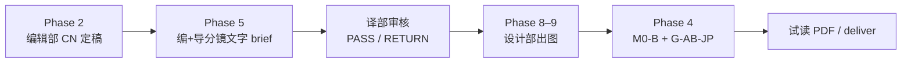

# 翻译部与编辑部 · 分工与门禁 · V1.0

> **Status**: **MANDATORY · 2026-06-10**  
> **原则**：中文定稿与日文定稿分属不同部门 · **2026-06-11**：M0-B/G-AB **不挡出图** · 译部对分镜 brief **PASS/RETURN** · 不 pending 卡线  
> **专家组详表**：[`V2迁移/107_JP翻译台_专家组分工_V1.0.md`](../V2迁移/107_JP翻译台_专家组分工_V1.0.md)

---

## 一、组织模型（两句话）

**编辑部**拥有 Hybrid Voice 中文正文、情节、角色深度与中文层语法；**不**拥有 JP 最终签字权。  
**翻译部**吸收田中みどり desk 与 GOUI/BUNPO/DOKUSHA/RONRI/SCI-RIKA/TANAKA 分岗；**只**负责 JP  prose、文化校准、儿童可读、grep/M0 清零与人名一致；**不**碰中文文学 craft。

---

## 二、翻译部

### 职责

| 范围 | 说明 |
|------|------|
| JP 正文 | V3.8 定稿 prose · MoA 润色 · 去直译腔 |
| 文化 | 名古屋校园 · 日本小学可读 · 田中五维文化汇总 |
| M0 清零 | 脚本批量（M0-A）+ 通读签字（M0-B）· 见 [`00_M0-M5_试读合规验收标准_V1.0.md`](./00_M0-M5_试读合规验收标准_V1.0.md) |
| grep / 名称 | `fix_jp_m0_batch.py` · 十人名称 LOCK · 禁内部代号 `案①` 等 |
| **不做** | 中文 Hybrid Voice · 情节改写 · 文学主编 M1–M3 |

### 成员表（107 映射）

| 代号 | 角色 | 产出 |
|------|------|------|
| HERMES-GOUI | 批量替换 + grep 清零 | M0-A PASS 表 |
| HERMES-BUNPO | 均句/留白/标日 J10 | 文体报告 |
| HERMES-DOKUSHA | 10–12 可读 + 振假名 | 可读报告 |
| HERMES-RONRI | 公平线索 JP 可见 | 推理公平报告 |
| SCI-RIKA | 广播/膜/影等理科术语 | 术语表 |
| EDITOR-SHO | 出版节奏 · 删审判腔 | 出版报告 |
| TANAKA | 五维文化汇总 · **M0-B 最终签字** | 复合体报告 · `run_desk.py` |

**Skill**：`academy-jp-tanaka-desk` · `academy-jp-voice-editor`

### 产出

| 产出 | 路径模式 |
|------|----------|
| JP 定稿正文 | `A00X/01_正文/案0X_*_HybridVoice_V3.8_日本語.txt` |
| M0-A 脚本报告 | grep 全绿日志 |
| M0-B 分报告 + 汇总签 | `01_正文/_archive/00_TANAKA-DESK_复合体报告_A00X.md` |
| 复合体打分 | `V2迁移/scores_desk_latest.json` |

### 门禁（2026-06-11 · 只过/退回）

| 关卡 | 条件 | 挡什么 |
|------|------|--------|
| **M0-A** | 脚本 + grep 清零 | deliver 前建议全绿 |
| **M0-B** | 田中汇总签字 | **仅试读 PDF / deliver** · 不挡 produce 出图 |
| **译部分镜审核** | `translation_verdict: PASS` | produce 出图 · RETURN→编+导 |
| **G-AB-JP** | 双盲 ≥9.0 | **仅 deliver** · RETURN→翻译部修稿 |
| **G-CAST 机器关** | prompt gate · COUNT_PASS | 不合格 RETURN 设计部 |

台账：[`00_译部分镜审核_单元1_V1.0.md`](./00_译部分镜审核_单元1_V1.0.md)

---

## 三、编辑部

### 职责

| 范围 | 说明 |
|------|------|
| CN Hybrid Voice | V3.1+ 定稿 · 短句留白 · 陸珣声线 |
| 情节 / 角色 | 节拍 · 功能抢位 · 水野能动性（M3） |
| 文学 craft | M1–M3 · `academy-voice-editor` · `academy-literary-audit` |
| 中文语法 | CN 层校对 |

### 边界（明确不做）

- **不**拥有 JP 最终 sign-off · 不替田中签 M0-B  
- **不**在 CN 未定稿时推进 JP 润色终稿  
- **不**直接写分镜 §11 日文气泡/屏显字（须链 JP V3.8 锚句）

---

## 四、Phase 顺序（LOCK）

| Phase | 部门 | 产出 | 裁决 |
|:-----:|------|------|------|
| 2 | **编辑部** | CN LOCK | PASS → 5 |
| 5 | **编+导** | 分镜文字稿 · G-CAST | `editorial_verdict: PASS` |
| 5.5 | **翻译部** | 分镜 brief 审核 | **PASS / RETURN** · 见 [`00_译部分镜审核_单元1_V1.0.md`](./00_译部分镜审核_单元1_V1.0.md) |
| 8–9 | **设计部** | Style B 成图 | G-CAST 机器关 |
| 4+4.5 | **翻译部** | M0-B · G-AB-JP | **仅 deliver 前** · FAIL=RETURN 译部 |
| 10 | 排版 | 05_排版 | G-AB-FULL 后 |

---

## 五、与现有文档索引

| 文档 | 关系 |
|------|------|
| [`107_JP翻译台_专家组分工_V1.0.md`](../V2迁移/107_JP翻译台_专家组分工_V1.0.md) | 翻译部成员/流水线详表 ★ |
| [`00_Agent工作流规则.md`](./00_Agent工作流规则.md) | Agent Phase 顺序 |
| [`00_M0-M5_试读合规验收标准_V1.0.md`](./00_M0-M5_试读合规验收标准_V1.0.md) | M0 验收细则 |
| [`00_插画师分镜文字稿总则_V1.0.md`](../../../07_设计原档/04_样章视觉/00_插画师分镜文字稿总则_V1.0.md) | 分镜 JP 锚句铁律 |
| [`00_设计部_插画画工流程_V1.0.md`](./00_设计部_插画画工流程_V1.0.md) | **设计部** · A/B 轨 · G-BRIEF · 双审 ★ |
| `.cursor/skills/academy-illustration-pipeline/SKILL.md` | Phase 4→5/8 门禁 |

---

最后更新：2026-06-11
