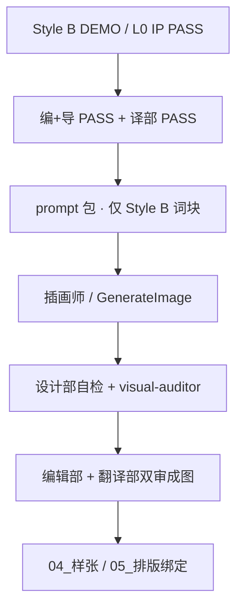

# 设计部 · 插画画工流程 · V1.0

> **Status**: **MANDATORY · 2026-06-10**  
> **命名**：对外统称 **设计部**（=`07_设计原档` 执行层 + 插画师发包）；口语可说「美工组」，文档统一用 **设计部**  
> **上游（2026-06-11）**：编+导 `editorial_verdict: PASS` + 译部 `translation_verdict: PASS` → 设计部接活 · **M0-B 不挡 produce**

---

## 一、三部门一句话

| 部门 | 只管什么 |
|------|----------|
| **编辑部** | 哪些镜头 **要画** · 画面瞬间 · 情节/深度 · CN 插页地图 |
| **翻译部** | 画中 **日文** 是否正确 · 文化/可读 · 与 JP V3.8 正文一致 |
| **设计部** | **Style B 已确认** 前提下按文字 brief **出图** · 造型/场景/深度 · 不交第二套画风 |

**不交叉**：编辑部不写 prompt · 翻译部不选构图 · 设计部不改情节。

---

## 二、两条插画线（同属设计部 · 标准不同）

| 轨道 | 内容 | 文字规则 | 深度/规范 |
|------|------|----------|-----------|
| **A 轨 · 正篇** | DA1–DA6 · TAIL · 教室/侧廊主帧 | **默认无字** · T2 | Style B LOCK · G-CAST · [`Vol1_插图深度标准`](../../../07_设计原档/02_插画与场景/Vol1_插图深度标准_湿椅子抽象_V1.0.md) |
| **B 轨 · 子项** | 瑆笔记 VS02 · 手がかり CL01 · 机制 DB1 · SUM | **指定日文 only** · 儿童笔迹/手账风 | REF05 铅笔网格 / 机制 Style B 手账 · **非** REF04 水彩主锚 |

两条线 **共用** Style B 角色脸与 L0 · **不** 另起水彩/动画风探索。

---

## 三、设计部接活 · 文字 brief（编+导提交 · 译部 PASS/RETURN）

**编+导** 产出 [`00_插画师分镜文字稿_V1.0.md`](../../../07_设计原档/04_样章视觉/00_插画师分镜文字稿总则_V1.0.md) + G-CAST · 设 `editorial_verdict: PASS`。

**翻译部** 审核分镜 brief · **只给 PASS 或 RETURN** · 台账 [`00_译部分镜审核_单元1_V1.0.md`](./00_译部分镜审核_单元1_V1.0.md)

| 字段 | 主责 | 译部审核 |
|------|------|----------|
| 画面瞬间 · G-CAST | 编+导 | JP 锚句 · 106 算术 |
| B 轨画中文字 | 编+导起草 | 日文句 PASS/RETURN |

**produce 接活条件**：`translation_verdict: PASS` · **pending → RETURN 译部，不卡其他案**

**deliver（试读 PDF）另需**：M0-B · G-AB-JP · COUNT_PASS

---

## 四、设计部内部流程

### 4.1 画风基础（全项目唯一 · 不另做风格）

| 项 | 正典 |
|----|------|
| 画风 LOCK | [`00_画风唯一正典_StyleB_LOCK_V1.0.md`](../../../07_设计原档/04_样章视觉/00_画风唯一正典_StyleB_LOCK_V1.0.md) |
| 造型 LOCK | L0 StyleB v0.2 + IP 确认方向 |
| DEMO 门 | **STYLE_DEMO PASS** 后才批量换 P0 帧 |
| **禁止** | 水彩 REF04 主锚 · USERSTYLE · 未 PASS 的第二套风格样张 |

### 4.2 设计部成员（映射专家库）

| 角色 | 职责 | Skill / 文档 |
|------|------|----------------|
| **分镜/深度** | P0 节点 · D1–D6 · 电影化构图 | `Vol1_分镜头电影化构图规范` · 深度锚点包 |
| **插画师** | 按 brief + Style B 成图 | [`跟插画师说_StyleB_V1.0.md`](../../../07_设计原档/04_样章视觉/跟插画师说_StyleB_V1.0.md) |
| **视觉审计** | 单帧 PASS/REJECT · 上履き/机制/G-CAST | `academy-visual-auditor` |
| **Pipeline** | Phase 8–9 门禁 | `academy-illustration-pipeline` |

### 4.3 成图双审（进排版前）

| 审项 | 编辑部 | 翻译部 | 设计部 |
|------|:------:|:------:|:------:|
| 构图/深度/公平线索 | ✅ | — | 自检 |
| 画中日文/零外语 | — | ✅ | — |
| Style B / 同脸同体 | — | — | ✅ auditor |
| G-CAST 人头 | 复核 | — | ✅ auditor |

**双审 PASS** → 写入 `03_插画/` 绑定 · `04_样张` PDF · 最后 **05_排版**。

---

## 五、全链路 Phase（三部门）

| Phase | 部门 | 产出 |
|:-----:|------|------|
| 2 | 编辑部 | CN 定稿 · 插页地图草案 |
| 4 | 翻译部 | JP V3.8 · M0 PASS |
| 5 | 编辑部主 · 翻译部副 | **分镜文字稿** · JP 锚句 |
| 5.5 | 专家 | G-TEXT · G-CAST · **G-BRIEF 双签** |
| 6 | 设计部 | Style DEMO / 深度 brief（已 LOCK 则跳过探索） |
| 8–9 | 设计部 | 成图 · auditor |
| 9.5 | 编+译 | 成图双审 |
| 10 | 排版 | E20 / PRODUCT PDF |

---

## 六、当前状态（A001 · 2026-06-10）

| 项 | 状态 |
|----|:----:|
| Style B 画风 | IP 可签 PASS |
| STYLE DEMO G-CAST | FAIL · 待 v1.1（4+≤2 人） |
| 翻译部 M0-B | 待田中汇总签 |
| 分镜文字稿 | 已有 · 须重链 JP V3.8 后 G-BRIEF 双签 |
| **设计部出图** | **冻结** 至 M0-B + G-BRIEF + DEMO/G-CAST |

---

## 七、索引

| 文档 | 用途 |
|------|------|
| [`00_翻译部与编辑部_分工_V1.0.md`](./00_翻译部与编辑部_分工_V1.0.md) | 编/译 |
| [`00_插画师分镜文字稿总则_V1.0.md`](../../../07_设计原档/04_样章视觉/00_插画师分镜文字稿总则_V1.0.md) | 文字 brief 字段 |
| [`00_A001-A005_插画师分镜补充规范_V1.0.md`](../../../07_设计原档/04_样章视觉/00_A001-A005_插画师分镜补充规范_V1.0.md) | §0 全局 · 交付清单 · 田中边界 |
| [`106_G-CAST`](../V2迁移/106_G-CAST_出场人数算术关_V1.0.md) | 人数 |
| [`00_画风唯一正典_StyleB_LOCK`](../../../07_设计原档/04_样章视觉/00_画风唯一正典_StyleB_LOCK_V1.0.md) | 画风 |
| [`00_Agent工作流规则.md`](./00_Agent工作流规则.md) | Agent 一案一时 |

---

最后更新：2026-06-10
