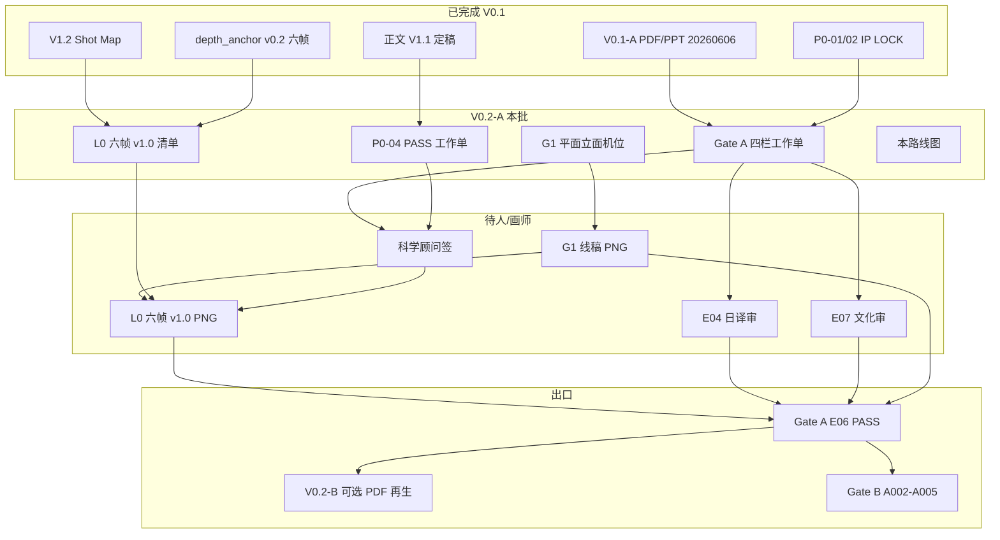

# V0.2-A · 第一话样张审阅 · 路线图

> **Status**: **ACTIVE** · 2026-06-06  
> **定位**：V0.1（概念样机）→ **V0.2-A**（Gate A 可执行审阅 + 近终稿资产）  
> **范围**：序 + A001 · Plan B · **非**湿椅子 · **非**全卷 Gate B  
> **分发**：[`05_视觉设定/第一话/分发包_V0.2-A_20260606/00_分发总索引.md`](../../../05_视觉设定/第一话/分发包_V0.2-A_20260606/00_分发总索引.md)

---

## 0. 版本差异

| 维度 | V0.1-A（20260606） | V0.2-A（本路线图） |
|------|-------------------|-------------------|
| PDF/PPT | 概念样机 · 四栏空白页 | 四栏**工作单**预填 + 同上 PDF 基线 |
| 分镜 | V1.2 制度表 | + 逐帧生产清单 + G1 机位图 |
| 插图 | depth_anchor **v0.2 探索** | 目标 **v1.0 近终稿** 六帧 |
| 科学 | P0-04 模板 | **PASS 工作单**预填 · 待顾问签 |
| 场景 | G1 文字说明 | G1 **SVG+标注 MD** · 画师 PNG 待 |
| 出口 | 专家初评 | **Gate A E06 PASS** 就绪 |

---

## 1. 依赖图



---

## 2. 执行顺序（推荐）

| 序 | 任务 | 负责 | 产出 | 状态 |
|:--:|------|------|------|------|
| **1** | 分发 V0.1-A + 四栏工作单 | 主编 | 专家并行审阅 | 🟡 工作单就绪 |
| **2** | G1 场景图确认 | 美术+分镜 | SVG+MD · 画师 PNG | 🟡 SVG 齐 · PNG 待 |
| **3** | 科学预审 v0.2 | 科学顾问 | P0-04 PASS 工作单签 | ⬜ 待人 |
| **4** | L0 六帧 v1.0 生产 | 画师/AI | 6×PNG v1.0 | ⬜ 待 G1 |
| **5** | 画风 Sheet 六测试帧验收 | 插画总监 | T1–T6 PASS | ⬜ 待 v1.0 |
| **6** | E04 日文 · E07 文化并行 | 顾问 | 四栏签核 | ⬜ 待人 |
| **7** | 四栏汇总 · 主编裁决 | 主编 | Exit Criteria §7 | ⬜ |
| **8** | 可选：regenerate V0.2-A PDF | Agent/脚本 | 嵌 v1.0 图 | ⬜ 非必须 |
| **9** | Gate A E06 PASS | 主编 | → Gate B 开工 | ⬜ |

---

## 3. 本批已交付文件

| # | 文件 | 用途 |
|---|------|------|
| 1 | [`05_视觉设定/第一话/GateA_四栏审阅工作单_V0.2-A_20260606.md`](../../../05_视觉设定/第一话/GateA_四栏审阅工作单_V0.2-A_20260606.md) | 四栏审阅可执行表 |
| 2 | [`07_设计原档/04_样章视觉/A001_侧廊空间灰模_G1_平面立面机位图_V0.2-A.md`](../../../07_设计原档/04_样章视觉/A001_侧廊空间灰模_G1_平面立面机位图_V0.2-A.md) | G1 标注+机位 |
| 3 | `07_设计原档/04_样章视觉/g1_*.svg`（5 文件） | G1 可编辑矢量 |
| 4 | [`样章包/06_A001_L0六帧_v1.0_生产清单.md`](../../样章包/06_A001_L0六帧_v1.0_生产清单.md) | 六帧生产+prompt delta |
| 5 | [`05_视觉设定/第一话/P0-04_科学与线索公平审核_A001_PASS工作单_V0.2.md`](../../../05_视觉设定/第一话/P0-04_科学与线索公平审核_A001_PASS工作单_V0.2.md) | 科学 PASS |
| 6 | 本路线图 | 依赖与顺序 |
| 7 | [`05_视觉设定/第一话/分发包_V0.2-A_20260606/`](../../../05_视觉设定/第一话/分发包_V0.2-A_20260606/00_分发总索引.md) | 四栏/画师/科学 **分发 brief**（8 文件） |

---

## 4. 仍阻塞（需人/画师）

| 阻塞 | 下一步 |
|------|--------|
| **科学顾问正式签** | 持 PASS 工作单 + v0.2 六帧图审阅 → 签 §5 |
| **G1 画师线稿 PNG** | 由 SVG/MD 发包 → G1a/G1b PASS |
| **L0 六帧 v1.0** | G1 PASS 后按生产清单逐帧 → E06 |
| **E04 日文母语** | V0.1-A 日文稿 + 田中 |
| **E07 校园五维** | 侧廊尺度/制度物 · 四栏工作单栏④ |
| **主编四栏汇总** | 无 HOLD → Gate A Exit |

---

## 5. V0.2-B 预留（非本批）

- 全卷 V0.1-B PDF 插图替换为 A001 v1.0
- 日文稿 E04 全页锁字
- CMYK 打样路径（Gate B 后）
- A002–A005 批量分镜（Gate B）

---

## 6. 快速命令

```powershell
# 再生 V0.1-A 基线（本批不必须）
cd "03_故事内容/第1卷_觉得奇怪就先观察/正式版"
python 05_出版成果/tools/build_expert_publication_pack.py --mode v01a
```

---

| 版本 | 2026-06-06 · V0.2-A 路线图 |
