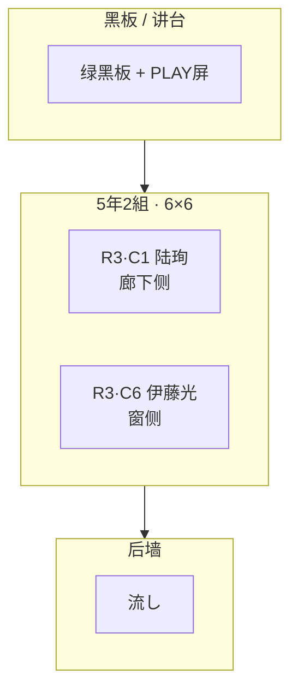

# 5年2組 · 班级座位表 V0.1

> **Status**: ACTIVE · 2026-06-08  
> **Authority**: [`01_角色设定/00_年级班级关系表_V1.0.md`](../../01_角色设定/00_年级班级关系表_V1.0.md) · doc35 G-BODY · `characters.yaml`  
> **Scope**: **5年2組 本班固定席** · 观察社核心仅 **陆珣 + 伊藤光** 同班

---

## 教室方位

| 方向 | 内容 |
|------|------|
| **北（前）** | 绿黑板 · 板槽 · 讲台 · 播音台/PLAY 屏 |
| **南（后）** | 流し · 扫除用具 · 后墙壁报/值日表 |
| **东** | **窗侧（窓際）** · 铝窗 → 校庭 |
| **西** | **廊下侧** · 引き戸 → 片廊下 |

**列号 C1–C6**：C1 = 最靠廊下 · C6 = 最靠窗  
**排号 R1–R6**：R1 = 最靠黑板（前排）· R6 = 最靠后墙

---

## 主人公固定席（LOCK）

| 角色 | 排·列 | 位置说明 | 叙事功能 |
|------|-------|----------|----------|
| **陆珣** | **R3 · C1** | 第3排 · 廊下侧首列 | 后排视野 · 不贴窗框 · 便于观察全班与讲台屏 |
| **伊藤光** | **R3 · C6** | 第3排 · 窗侧末列 | 窓際 · 习惯站在大家能看见处 · A001 被点名上台 |

> **注**：A001 序/合班教室场景中 **水野真帆** 为 **5年1組** 来访协助，临时坐靠窗第二列 —— **非本班固定席**，见 [`44_主人公班级与座位表_V0.1.md`](../../03_故事内容/第1卷_觉得奇怪就先观察/V2迁移/44_主人公班级与座位表_V0.1.md)。

---

## ASCII 座位网格（俯视 · 黑板在上）

```
                    【 黑 板 · 讲 台 】
    廊下侧 C1    C2    C3    C4    C5    C6  窗侧
R1  [  ]     [  ]   [  ]   [  ]   [  ]   [  ]
R2  [  ]     [  ]   [  ]   [  ]   [  ]   [  ]
R3  [陆珣]   [  ]   [  ]   [  ]   [  ]   [伊藤光]
R4  [  ]     [  ]   [  ]   [  ]   [  ]   [  ]
R5  [  ]     [  ]   [  ]   [  ]   [  ]   [  ]
R6  [  ]     [  ]   [  ]   [  ]   [  ]   [  ]
                    【 流し · 后墙 】
```

---

## Mermaid（可选渲染）



---

## 轮换说明

- 名古屋公立小学习惯 **1–2 周换座**；上表为 **Vol1 叙事主锚**（doc35 · 分镜站位）。
- 换座后 **相对关系** 不变：珣偏观察位（廊下/后排）· 光偏窗侧行动位。

---

*最后更新：2026-06-08 · CLASS_5-2 V0.1*
