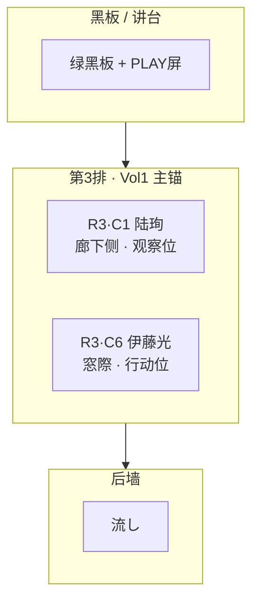

# 5年2組 · 教室插图锚点 · V0.1

> **Status**: ACTIVE · 2026-06-08  
> **SSOT 座席**: [`CLASS_5-2_座位表_V0.1.md`](./CLASS_5-2_座位表_V0.1.md) · doc44  
> **建筑复用**: [`CLASSROOM_4-2_perspective_baseline_spec.md`](../02_插画与场景/CLASSROOM_4-2_perspective_baseline_spec.md)（文件名历史名 · 内容=5年2組）  
> **L0 角色**: [`CHAR_lineup_L0_专家共识_画师发包_3840.png`](./CHAR_lineup_L0_专家共识_画师发包_3840.png)

---

## 教室方位（LOCK）

| 方向 | 内容 |
|------|------|
| **北（前）** | 绿黑板 · 板槽 · 讲台 · PLAY 屏 |
| **南（后）** | 流し · 扫除用具 · 后墙壁报 |
| **东** | **窗侧 C6** · 铝窗 → 校庭 |
| **西** | **廊下侧 C1** · 引き戸 → 片廊下 |

**列 C1–C6**：C1 = 廊下侧首列 · C6 = 窗侧末列  
**排 R1–R6**：R1 = 靠黑板 · R6 = 靠后墙

---

## ASCII 座席（俯视 · 黑板在上）

```
                    【 黑 板 · 讲 台 】
    廊下 C1    C2    C3    C4    C5    C6  窗侧
R1  [  ]     [  ]   [  ]   [  ]   [  ]   [  ]
R2  [  ]     [  ]   [  ]   [  ]   [  ]   [  ]
R3  [陆珣]   [  ]   [  ]   [  ]   [  ]   [伊藤光]
R4  [  ]     [  ]   [  ]   [  ]   [  ]   [  ]
R5  [  ]     [  ]   [  ]   [  ]   [  ]   [  ]
R6  [  ]     [  ]   [  ]   [  ]   [  ]   [  ]
                    【 流し · 后墙 】
```

---

## Mermaid



---

## 分镜帧 · 座席必检（CLASSROOM 场景）

| 案 | Shot | 机位 | 珣 | 光 | 备注 |
|:--:|------|------|----|----|------|
| A001 | DA1 广播响起 | MS 东向 | **R3·C1 侧后** 或站廊侧看 PLAY 屏 | **讲台 C**（非就座）· 唇未动 | 合班教室 · 光被点名上台 |
| A001 | DA2 观察社介入 | MS 同轴 | R3·C1 记录位 | 讲台/脸白 | 慧美 5-1 挤入 · 无固定席 |
| A001 | DA3–DA4 | MCU/CU | POV 自 R3·C1 区 | 侧脸/虚化 | 框中框平板 |
| A001 | DA5 误指峰值 | MS 略俯 | 设备侧 · 廊下列 | 讲台 | 全景须可读 C1/C6 列向 |
| A002 | DA1 黑板对不起 | MS | R3·C1 观察 | — | 5年2組本班 · 志郎 5-3 扫除当番入 |
| A002 | DA3–DA4 | MCU/MS | 廊下侧 | — | 板槽 POV 自 C1 侧合理 |
| A004 | 抽屉/柜 | MS | R3·C1 或廊边 | — | 失物柜靠墙 · 非粉笔灰圈 |
| A005 | — | 体育馆 | N/A | N/A | **非本班教室** · 见 doc16 体育馆 brief |

**异班社员**：慧美 **5年1組** · 志郎 **5年3組** — 教室帧 **无 R 网格固定席** · 仅侧廊/器材区/合班临时入画。

**客座**：水野真帆（5-1）A001 合班可画 **靠窗第二列临时席** · 非 R3·C6 固定。

---

## G-BODY P0 · 座席 REJECT

| 项 | REJECT |
|----|--------|
| 珣就座 | 窗侧 C6 · 前排 C 位抢光 |
| 光就座 | 廊下 C1 · 与「窓際行动位」叙事冲突 |
| 四人同班 | 慧美/志郎画进 5-2 固定网格 |
| 年级 | 4年2組 名牌/鞋柜/班牌 |
| 旧 DEMO | 4年2組 平面 DEMO · 珣 R3C2 / 光 R4C4 |

---

## 关联资产

| 类型 | 路径 |
|------|------|
| 透视 HTML | `07_设计原档/02_插画与场景/CLASSROOM_4-2_baseline.html` |
| 参考 PNG | `CLASSROOM_4-2_perspective_reference.png` |
| 空间总图 | `04_样章视觉/spatial/README.md`（待画师重绘 5-2 总平面） |
| doc16 | `V2迁移/16_V2空间资产复用与建筑插画专家组_V0.1.md` |

---

*最后更新：2026-06-08 · CLASS_5-2 教室插图锚点 V0.1*
