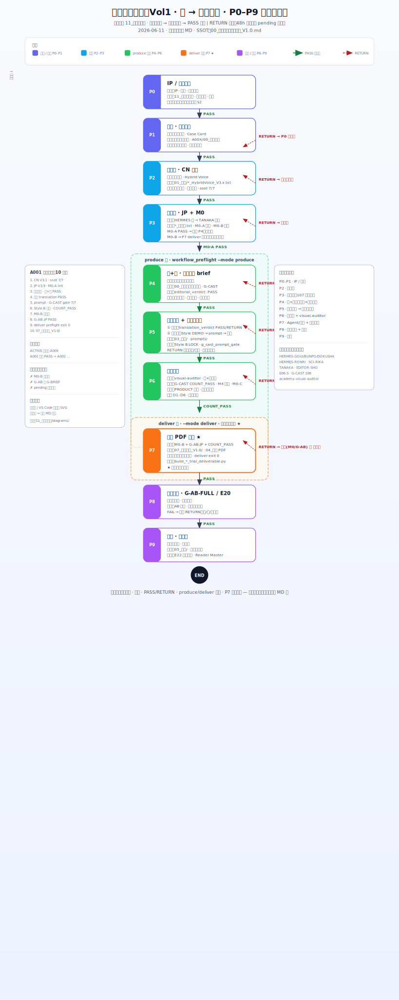

# 全流程 · P0–P9 可视化流程图 · V1.0

> **Status**: **CONFIRMED · 2026-06-11**  
> **配套 SSOT**：[00_全流程标准作业手册_V1.0.md](./00_全流程标准作业手册_V1.0.md)  
> **图源**：[diagrams/00_全流程_P0-P9_示意图_V1.0.svg](./diagrams/00_全流程_P0-P9_示意图_V1.0.svg)

---

## 一、怎么用这张图

| 用途 | 做法 |
|------|------|
| **看全局** | 打开下方嵌入图或 SVG 原文件 · 自上而下跟箭头 |
| **知道谁干活** | 每框「工位」行 · 或侧栏「工位主责速查」 |
| **知道怎么往下走** | 绿线 **PASS** → 下一 P · 红虚线 **RETURN** → 退回框内写的工位 |
| **知道何时能出图/何时能试读** | 绿虚线框 = **produce**（P4–P6）· 橙虚线框 = **deliver**（P7 ★） |
| **查细则/验收表** | 本图只编排顺序 · 条文见 [标准作业手册](./00_全流程标准作业手册_V1.0.md) §二 Action Card |

**裁决铁律**：每步只输出 **PASS** 或 **RETURN** · 48h 内 · 禁止 pending 卡全线。

---

## 二、流程图（SVG）



> 若预览不清晰：用浏览器或设计工具打开 [`diagrams/00_全流程_P0-P9_示意图_V1.0.svg`](./diagrams/00_全流程_P0-P9_示意图_V1.0.svg) 原文件（1280×3200 · 可缩放）。

---

## 三、阶段一步表（与图对齐）

| P | 名称 | 工位 | 关键交付 | PASS → | RETURN → |
|:-:|:-----|------|----------|--------|----------|
| **P0** | IP/治理立项 | IP · 主编 | `11_规则与规范/` · 目录架构 | P1 | P0 补治理 |
| **P1** | 案卡·单元框架 | 主编 | 五案框架 · `A00X/00_正典指针` | P2 | P1 改 Case |
| **P2** | CN 定稿 | 编辑部 | `01_正文/*_HybridVoice_V3.x.txt` | P3 | 编辑部改稿 |
| **P3** | JP + M0 | 翻译部 | `*_日本語.txt` · M0-A/B | P4（M0-A PASS） | 翻译部 |
| **P4** | 分镜文字 brief | 编+导 | `00_插画师分镜文字稿` · G-CAST | P5 | 编+导改 brief |
| **P5** | 译部审核+出图 | 译部+设计部 | `translation_verdict` · `03_插画/` | P6 | 译部/编+导 |
| **P6** | 成图验收 | 设计部+审计 | COUNT_PASS · Style B | P7 准备 | 设计部重绘 |
| **P7** | 试读 PDF ★ | Agent+主编 | `07_试读交付_V1.0/` | P8 | 译部(M0/G-AB)/设计部 |
| **P8** | G-AB-FULL/E20 | 读者+主编 | 盲测 · 真实试读 | P9 | 分轨退回 |
| **P9** | 排版正式版 | 排版 | `05_排版/` | END | 排版/定稿 |

★ **试读小样完成线** = **P7** · `deliver` preflight exit 0 · 见手册 §七。

---

## 四、produce / deliver 分界

```
P2 CN ──→ P3 M0-A ──→ P4 brief ──→ P5 出图 ──→ P6 验收
                              └──── produce 区（--mode produce）────┘

P6 就绪 + M0-B + G-AB-JP + COUNT_PASS ──→ P7 试读 PDF
                              └──── deliver 区（--mode deliver）────┘
```

| 模式 | 命令 | 不检查 | 必须检查 |
|------|------|--------|----------|
| **produce** | `workflow_preflight.py --mode produce` | M0-B · G-AB-JP | 编+导 PASS · 译部 PASS · prompt G-CAST |
| **deliver** | `--mode deliver --phase review-pack` | — | produce 项 + M0-B + G-AB-JP + COUNT_PASS |

---

## 五、A001 → 试读交付 · 十步（图侧栏摘要）

1. CN V3.1 · `ssot_gate` 7/7  
2. JP V3.9 · M0-A lint  
3. 分镜文字 · `editorial_verdict: PASS`  
4. 译部 · `translation_verdict: PASS`  
5. prompt · `g_cast_prompt_gate` 7/7  
6. Style B 成图 · COUNT_PASS  
7. M0-B 田中签  
8. G-AB-JP PASS  
9. `deliver` preflight exit 0  
10. 产出 `A001/07_试读交付_V1.0/`

---

## 六、已废止（图中侧栏 · 勿再作硬拦）

- M0-B 未签 → 禁止出图  
- G-AB-JP 未 PASS → 禁止 G-BRIEF / 设计部  
- 空 `[ ]` pending → 全线停摆  

→ 现行：**produce 并行出图 · deliver 试读前再验 M0/G-AB** · 见 [硬拦截说明](../03_故事内容/第1卷_觉得奇怪就先观察/单元1_第一单元_五案/00_硬拦截说明_V1.0.md)

---

## 七、相关链接

| 文档 | 用途 |
|------|------|
| [00_全流程标准作业手册_V1.0.md](./00_全流程标准作业手册_V1.0.md) | Action Card · 121 规范映射 |
| [00_总索引_V1.0.md](./00_总索引_V1.0.md) | 规范包入口 |
| [单元1 · 译部分镜审核](../03_故事内容/第1卷_觉得奇怪就先观察/单元1_第一单元_五案/00_译部分镜审核_单元1_V1.0.md) | PASS/RETURN 台账 |
| [单元1 · 编+导分镜审定](../03_故事内容/第1卷_觉得奇怪就先观察/单元1_第一单元_五案/00_导演组编辑组_分镜插画文字版审定_V1.0.md) | 36 帧文字 SSOT |

---

最后更新：2026-06-11 · 示意图已确认 · MD 与 SVG 同步
