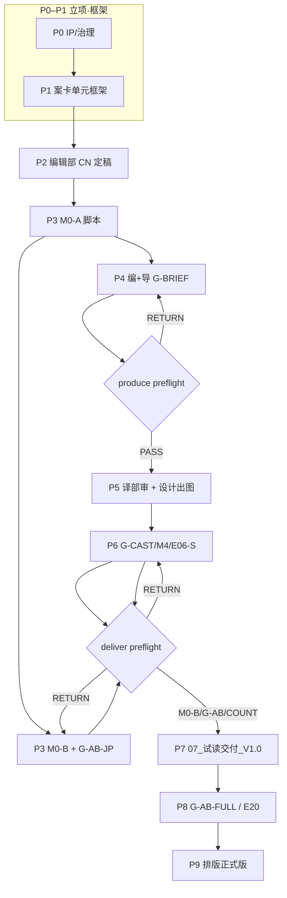

# 全流程标准作业手册 · V1.0

> **Status**: **MANDATORY · 流程 SSOT**  
> **定位**：把 `11_规则与规范/` 内 **121 份 V1.0 规范** 串成 **可执行工作流** — 标准已在包内，本手册 **不重复条文**，只给 **工位·动作·路径·验收·裁决**  
> **原则**：**执行标准 → 对照验收表 → 只输出 PASS 或 RETURN** · **禁止 pending 卡全线**  
> **双模式**：`produce`（出图并行）与 `deliver`（试读交付）见 [`workflow_preflight.py`](../../03_故事内容/第1卷_觉得奇怪就先观察/tools/workflow_preflight.py) · 2026-06-11  
> **单元 live 文档**：[`00_译部分镜审核_单元1_V1.0.md`](../../03_故事内容/第1卷_觉得奇怪就先观察/单元1_第一单元_五案/00_译部分镜审核_单元1_V1.0.md) · [`00_导演组编辑组_分镜插画文字版审定_V1.0.md`](../../03_故事内容/第1卷_觉得奇怪就先观察/单元1_第一单元_五案/00_导演组编辑组_分镜插画文字版审定_V1.0.md) · [`00_硬拦截说明_V1.0.md`](../../03_故事内容/第1卷_觉得奇怪就先观察/单元1_第一单元_五案/00_硬拦截说明_V1.0.md)  
> **规则索引**：[00_总索引_V1.0.md](./00_总索引_V1.0.md)  
> **可视化流程图**：[00_全流程_P0-P9_可视化流程图_V1.0.md](./00_全流程_P0-P9_可视化流程图_V1.0.md) · [SVG](./diagrams/00_全流程_P0-P9_示意图_V1.0.svg)  
> 更新：2026-06-11

---

## 〇、运作原则

### 0.1 唯一真理源

| 层级 | 路径 | 用途 |
|------|------|------|
| **规范包** | `11_规则与规范/` | 121 份 V1.0 · 分类见总索引 |
| **流程 SSOT** | **本手册** | 阶段顺序 · 工位 · 裁决 · 脚本 |
| **案级正本** | `03_故事内容/…/单元1_第一单元_五案/A00X/` | 正文 · 分镜 · 插画 · 试读交付 |

**禁止**：在进度表写 `BLOCKED_HUMAN` / `PENDING` 当终态 — 须 **48h 内** 给出 **PASS** 或 **RETURN**（含 `return_to` 工位）。

### 0.2 裁决二元律

```
工位执行动作 → 对照验收 SSOT → PASS（放行下一检查）| RETURN（退回 return_to 工位）
```

| 禁止 | 替代 |
|------|------|
| 「等主编决定要不要继续」 | RETURN + 修改清单 + 责任工位 |
| `editorial_verdict: pending` 卡 produce | 视为 `TRANSLATION_REVIEW_REQUIRED` · exit 1 |
| AI-DESK 代签 M0-B | 仅真人 TANAKA 汇总签 · 见 107 分工 |
| 模拟 doc79 分当 G-AB PASS | 盲测须独立人群 · 见 AB 闸 |

### 0.3 produce vs deliver（2026-06-11）

| 模式 | 命令 | 检查项 | 用途 |
|------|------|--------|------|
| **produce** | `workflow_preflight.py --mode produce` | 编+导 PASS · 译部 PASS · （可选）prompt G-CAST | 设计部写 prompt · 出 DEMO/PRODUCT · 内部样张 |
| **deliver** | `--mode deliver --phase review-pack` | produce 项 + **M0-B** + **G-AB-JP** + **COUNT_PASS** | `07_试读交付_V1.0/` · 审阅包 · 对外 PDF |

**已废止的旧顺序**（见 §八）：**G-AB-JP 挡 G-BRIEF** · **M0-B 挡出图** — 本手册 **P4–P6 走 produce** · **P7 走 deliver**。

### 0.4 路径模式（A001 → A005 同构）

```
03_故事内容/第1卷_觉得奇怪就先观察/单元1_第一单元_五案/
├── A00X/
│   ├── 00_正典指针.md
│   ├── 01_正文/          HybridVoice_V3.x.txt · *_日本語.txt · _ab_test/
│   ├── 02_分镜头/        00_插画师分镜文字稿 · 00_G-BRIEF · 00_G-CAST · prompts/
│   ├── 03_插画/          Style B 成图 · 00_插图清单
│   ├── 04_样张/          pilot PDF · M0-C 审计
│   ├── 07_试读交付_V1.0/  deliver 模式产出 · PDF + 正文 + 分镜 + P0 插图
│   └── 05_排版/          P9 · G-AB-FULL 后
└── 00_单元导航.md · 00_正本登记册_V1.0.md
```

---

## 一、端到端阶段总览（P0 → P9）

| 阶段 | 名称 | 工位主责 | 模式 | 试读小样 scope |
|:----:|------|----------|:----:|:--------------:|
| **P0** | IP/治理立项 | IP · 主编 | — | — |
| **P1** | 案卡与单元框架 | 主编 · 总策划 | — | — |
| **P2** | 编辑部 CN 定稿 | 编辑部 | — | ✅ |
| **P3** | 翻译部 JP + M0-A/B | 翻译部 | deliver 前置 | ✅ |
| **P4** | 编+导分镜文字 brief | 编辑部 + 导演组 | **produce** | ✅ |
| **P5** | 译部审核 + 设计部出图 | 翻译部 + 设计部 | **produce** | ✅ |
| **P6** | 成图验收 G-CAST/M4 | 设计部 + 视觉审计 | produce 后 | ✅ |
| **P7** | 试读 PDF 交付 | Agent/工具 + 主编 | **deliver** | ✅ **终点** |
| **P8** | 读者试读 G-AB-FULL / E20 | 读者运营 + 主编 | — | 延伸 |
| **P9** | 排版正式版 | 排版 · 出版社 | — | 超出小样 |

---

## 二、阶段 Action Card

### P0 · IP/治理立项

| 项 | 内容 |
|----|------|
| **工位** | IP Owner · 系列主编 · 正典治理 |
| **专家组** | E06（IP 终签）· canon-governor · gate-orchestrator |
| **标准动作** | 1. 读 Layer 0 启动门 · 2. 锁定年级 V2 · 名称 LOCK · 3. 部署 12 Skill + P0 校准包 · 4. 跑 P0 自审 |
| **交付物** | `CLAUDE.md` · `AGENTS.md` · `00_正典门禁` · `11_规则与规范/` 包 |
| **验收 SSOT** | [完整产品阶段交付包 §2](./01_项目治理/完整产品阶段交付包_V1.0.md) · [项目状态表述规范](./01_项目治理/项目状态表述规范_V1.0.md) · [00_目录架构_三段式](./01_项目治理/00_目录架构_三段式_V1.0.md) |
| **裁决** | PASS → P1 · RETURN → 补正典漂移项 |
| **脚本** | `python scripts/audit_phase_package.py --phase P0` · `python scripts/pre_push_check.py` |

---

### P1 · 案卡与单元框架

| 项 | 内容 |
|----|------|
| **工位** | 系列主编 · academy-series-architect · story-database |
| **专家组** | E1/F1 战略 · Case Card C03/C04 |
| **标准动作** | 1. 五案单元框架总表 · 2. 正本登记册 · 3. A00X 目录 scaffold · 4. A001 测试启动单 |
| **交付物** | `00_Vol1_五案单元框架总表` · `A00X/00_正典指针.md` · Case Card |
| **验收 SSOT** | [00_Vol1_五案单元框架总表](./03_工作流与闸门/00_Vol1_五案单元框架总表_V1.0.md) · [00_正本登记册](./03_工作流与闸门/00_正本登记册_V1.0.md) · [00_A001测试启动单](./03_工作流与闸门/00_A001测试启动单_V1.0.md) |
| **裁决** | PASS → P2（按案并行 A002–A005） · RETURN → 框架/Case 修订 |
| **脚本** | `python scripts/volume_lint.py --all` |

---

### P2 · 编辑部 CN 定稿

| 项 | 内容 |
|----|------|
| **工位** | 编辑部 · academy-engine → literary-audit → voice-editor |
| **专家组** | 文学主编 · L1 三并列（文化/环境/公平）· character-director |
| **标准动作** | 1. Hybrid Voice 正文 · 2. 场级 20 项审计 · 3. GPT_LOCK / REVIEW LOOP · 4. G-BODY 签（生产化解锁） |
| **交付物** | `A00X/01_正文/案0X_*_HybridVoice_V3.x.txt` |
| **验收 SSOT** | [学堂趣事录_文学叙事与描写执行标准](./02_创作与文学/学堂趣事录_文学叙事与描写执行标准_V1.0.md) · [全书级语言去重与描写变奏](./02_创作与文学/全书级语言去重与描写变奏标准_V1.0.md) · [Vol1_声线验收清单](./01_项目治理/Vol1_声线验收清单_V1.0.md) · [原V2迁移/24_最小路径_CN正文](./03_工作流与闸门/原V2迁移/24_最小路径_CN正文工作流_V1.0.md) |
| **裁决** | PASS（单案 ≥9.8 · 单元 ≥9.5）→ P3 · RETURN → 编辑部改稿 |
| **脚本** | `python scripts/vol1_ssot_gate.py --case A00X` |

---

### P3 · 翻译部 JP + M0

| 项 | 内容 |
|----|------|
| **工位** | 翻译部 · academy-jp-voice-editor · jp-tanaka-desk |
| **专家组** | HERMES-GOUI/BUNPO/DOKUSHA/RONRI · SCI-RIKA · EDITOR-SHO · **TANAKA**（见 §四） |
| **标准动作** | 1. CN→JP 初译 · 2. M0-A 脚本清稿 · 3. MoA 四视角 · 4. M0-B 分报告 → TANAKA 汇总签 · 5. 准备 G-AB-JP 盲测包 |
| **交付物** | `A00X/01_正文/案0X_*_HybridVoice_V3.x_日本語.txt` · `_ab_test/` · `G-AB-JP_汇总裁决_A00X.md` |
| **验收 SSOT** | [00_M0-M5_试读合规验收标准](./03_工作流与闸门/00_M0-M5_试读合规验收标准_V1.0.md) · [107_JP翻译台_专家组分工](./03_工作流与闸门/原V2迁移/107_JP翻译台_专家组分工_V1.0.md) · [日文正文文字与语法标准](./01_项目治理/日文正文文字与语法标准_标日对齐_V1.0.md) · [00_翻译部与编辑部_分工](./03_工作流与闸门/00_翻译部与编辑部_分工_V1.0.md) |
| **裁决** | M0-A PASS → 可并行 P4（produce）· M0-B + G-AB-JP PASS → deliver 放行 P7 · RETURN → 翻译部 |
| **脚本** | `fix_jp_m0_batch.py` · `lint_jp_corruption.py` · `jp_tanaka_desk/run_desk.py --case A00X` |

---

### P4 · 编+导分镜文字 brief

| 项 | 内容 |
|----|------|
| **工位** | 编辑部 + 导演组（编+导） |
| **专家组** | 文学主编 · visual-auditor（文字层）· P0-04 科学公平 |
| **标准动作** | 1. 插页地图对齐 JP 锚 · 2. 撰写 `00_插画师分镜文字稿` · 3. G-BRIEF 双签 frontmatter · 4. 单元 joint 审定 |
| **交付物** | `A00X/02_分镜头/00_插画师分镜文字稿_V1.0.md` · `00_G-BRIEF_双签_A00X_V1.0.md` · `03_分镜头_插页地图_*` |
| **验收 SSOT** | [00_插画师分镜文字稿总则](./04_视觉与插画/00_插画师分镜文字稿总则_V1.0.md) · [00_G-BRIEF_双签](./03_工作流与闸门/00_G-BRIEF_双签_A001_V1.0.md) · [00_单案分镜头交付模板](./03_工作流与闸门/00_单案分镜头交付模板_V1.0.md) · [Vol1_分镜头电影化构图规范](./04_视觉与插画/Vol1_分镜头电影化构图规范_V1.0.md) |
| **裁决** | `editorial_verdict: PASS` → 译部审核 · RETURN → 编+导（`return_to: editorial`） |
| **脚本** | `workflow_preflight.py --mode produce`（检查 editorial） |

**live**：[`00_导演组编辑组_分镜插画文字版审定_V1.0.md`](../../03_故事内容/第1卷_觉得奇怪就先观察/单元1_第一单元_五案/00_导演组编辑组_分镜插画文字版审定_V1.0.md)

---

### P5 · 译部审核 + 设计部出图（produce）

| 项 | 内容 |
|----|------|
| **工位** | 翻译部（分镜审核）· 设计部（Style B 出图） |
| **专家组** | 译部：GOUI/BUNPO · 设计：academy-illustration-pipeline · Style B LOCK |
| **标准动作** | 1. 译部 48h 内 `translation_verdict: PASS|RETURN` · 2. 写 prompts（G-CAST 块）· 3. DEMO → PRODUCT · 4. **不等待 G-AB-JP** |
| **交付物** | `A00X/02_分镜头/prompts/*.md` · `A00X/03_插画/*` · `00_插图清单` |
| **验收 SSOT** | [00_译部分镜审核](./03_故事内容/第1卷_觉得奇怪就先观察/单元1_第一单元_五案/00_译部分镜审核_单元1_V1.0.md) · [00_设计部_插画画工流程](./03_工作流与闸门/00_设计部_插画画工流程_V1.0.md) · [00_画风唯一正典_StyleB_LOCK](./04_视觉与插画/00_画风唯一正典_StyleB_LOCK_V1.0.md) · [106_G-CAST](./03_工作流与闸门/原V2迁移/106_G-CAST_出场人数算术关_V1.0.md) |
| **裁决** | produce preflight exit 0 → 可 GenerateImage · RETURN → 译部或编+导 |
| **脚本** | `workflow_preflight.py --mode produce --phase generate-image --prompt …/DA2.md` · `g_cast_prompt_gate.py` |

---

### P6 · 成图验收（G-CAST / visual-auditor / M4）

| 项 | 内容 |
|----|------|
| **工位** | 设计部 · academy-visual-auditor · IP 视觉 |
| **专家组** | E06-S 自查 · M0-C5 G-CAST · M4 Style B · SCI-RIKA（机制帧） |
| **标准动作** | 1. 导演审定表逐镜双签 · 2. COUNT_PASS · 3. M0-C OCR 零外文 · 4. M4 画风连续 · 5. E06-S 审计 |
| **交付物** | `00_G-CAST_导演审定表_A00X` · `M0-C_*审计` · `100_A00X_E06S_自查审计` |
| **验收 SSOT** | [102_A001_MVP插画审查对照表](./03_工作流与闸门/原V2迁移/102_A001_MVP插画审查对照表_V1.0.md) · [22_科学视觉审校表](./04_视觉与插画/22_科学视觉审校表_V1.0.md) · [03_视觉系统总控检查清单](./04_视觉与插画/03_视觉系统总控检查清单_V1.0.md) · [A001_锚点6帧_连续性检查](./04_视觉与插画/A001_锚点6帧_连续性检查_V1.0.md) |
| **裁决** | COUNT_PASS + M4 → P7 deliver · RETURN → 设计部重绘 |
| **脚本** | `g_cast_prompt_gate.py`（逐帧）· `academy-visual-auditor` 清单 |

---

### P7 · 试读 PDF 交付（deliver）

| 项 | 内容 |
|----|------|
| **工位** | Agent/工具 · 主编 · 翻译部（M0-B/G-AB 签字） |
| **专家组** | TANAKA M0-B · G-AB-JP 双人群 · 主编汇总裁决 |
| **标准动作** | 1. `workflow_preflight --mode deliver` 全绿 · 2. 绑 V3.9 JP + P0 插图 · 3. 产出 `07_试读交付_V1.0/` · 4. 更新正典指针 |
| **交付物** | `A00X/07_试读交付_V1.0/PDF/` · `01_正文/` · `02_分镜/` · `03_插图_P0/` |
| **验收 SSOT** | [00_M0-M5 §M0-B/C](./03_工作流与闸门/00_M0-M5_试读合规验收标准_V1.0.md) · [00_AB盲测闸门 §G-AB-JP](./03_工作流与闸门/00_AB盲测闸门_V1.0.md) · [Vol1_桥梁书产品出厂验收 §P1](./01_项目治理/Vol1_桥梁书产品出厂验收标准_V1.0.md) · [E22_屏幕PDF打样验收清单](./04_视觉与插画/E22_屏幕PDF打样验收清单_V1.0.md) |
| **裁决** | deliver exit 0 → **试读小样完成** · RETURN → 见 preflight 代码（M0B/GAB/COUNT） |
| **脚本** | `build_a001_trial_deliverable.py` · `build_unit1_trial_pdf.py` · `assemble_a001_review_pack.py` |

**deliver 检查顺序**：编+导 PASS → 译部 PASS → **M0-B** → **G-AB-JP** → **COUNT_PASS**

---

### P8 · 读者试读 G-AB-FULL / E20

| 项 | 内容 |
|----|------|
| **工位** | 读者运营 · 主编 · 翻译/编辑/设计（分轨退回） |
| **专家组** | 全席 E01–E25 · R1/R2/R3/P1/T1 读者群 |
| **标准动作** | 1. G-AB-FULL 盲测 · 2. E20 真实 10–12 岁试读 ≥1/12 · 3. 汇总修改清单 · 4. 分轨 RETURN |
| **交付物** | `04_样张/_ab_test/` · E20 探针数据 · 105_真实读者评判 |
| **验收 SSOT** | [00_AB盲测闸门 §G-AB-FULL](./03_工作流与闸门/00_AB盲测闸门_V1.0.md) · [105_真实读者评判_执行路线](./03_工作流与闸门/原V2迁移/105_真实读者评判_执行路线_V1.0.md) · [03_问卷_儿童家长_日本語](./03_工作流与闸门/03_问卷_儿童家长_日本語_V1.0.md) |
| **裁决** | PASS → P9 · RETURN → 责任工位（文/图/排版分列） |
| **脚本** | `run_a001_workflow_trial.py` · E20 包工具 |

---

### P9 · 排版正式版（超出试读小样 · 简述）

| 项 | 内容 |
|----|------|
| **工位** | 排版 · 出版社责编 · 印厂接口 |
| **专家组** | E22 版式 · J-FINAL · P-PROOF |
| **标准动作** | InDesign/CMYK · Reader Master · 全卷样 · PRODUCT-GATE |
| **交付物** | `A00X/05_排版/` · `Vol1_Reader_Master` · 出版成果包 |
| **验收 SSOT** | [E22_书籍形态与排版规范_LOCK](./04_视觉与插画/E22_书籍形态与排版规范_LOCK_V1.0.md) · [Vol1_Reader_Master_母版规格](./04_视觉与插画/Vol1_Reader_Master_母版规格_V1.0.md) · [V0.1_出版成果包说明](./03_工作流与闸门/V0.1_出版成果包说明_V1.0.md) |
| **裁决** | G-AB-FULL PASS 前置 · PRODUCT-GATE 全 ✅ → 发行 |
| **脚本** | `python scripts/audit_phase_package.py --phase P3` |

---

## 三、工位矩阵（编辑部 | 翻译部 | 设计部 | IP | 主编）

| 阶段 | 编辑部 | 翻译部 | 设计部 | IP | 主编 |
|:----:|:------:|:------:|:------:|:--:|:----:|
| P0 | ○ 规范 | ○ 规范 | ○ 规范 | **●** | **●** |
| P1 | ○ Case | — | — | ○ | **●** |
| P2 | **●** | — | — | ○ 红线 | **●** 签 G-BODY |
| P3 | ○ 对照 | **●** M0 | — | — | ○ G-AB 分发 |
| P4 | **●** brief | ○ 锚句 | — | — | ○ |
| P5 | ○ G-CAST 文 | **●** 分镜审 | **●** 出图 | ○ Style | ○ |
| P6 | ○ G-TEXT | ○ B轨日文 | **●** 验收 | **●** M4 | ○ E06 |
| P7 | ○ | **●** M0-B/G-AB | ○ 绑图 | ○ | **●** 交付签 |
| P8 | ○ 改文 | ○ 改 JP | ○ 改图 | ○ | **●** 盲测 |
| P9 | ○ | ○ J-FINAL | ○ CMYK | **●** | **●** |

图例：**●** 主责 · ○ 参与/签核

---

## 四、专家组注册表（107 + 视觉）

### 4.1 JP 翻译台（107 映射）

| 代号 | 专家库 | Skill/工具 | 阶段 | 产出 |
|------|--------|------------|:----:|------|
| HERMES-GOUI | E04 LNG | `fix_jp_m0_batch.py` | P3 | M0-A PASS 表 |
| HERMES-BUNPO | E04 | `academy-jp-voice-editor` MoA#2 | P3 | 文体报告 |
| HERMES-DOKUSHA | E03 | MoA#4 · L11 | P3 | 可读/振假名 |
| HERMES-RONRI | E05 | `academy-engine` C03 | P3 | 公平 JP |
| SCI-RIKA | P0-04 | P0-04 科学表 | P3/P6 | 术语/机制视觉 |
| EDITOR-SHO | E16 | doc81 · GateA | P3/P8 | 出版节奏 |
| **TANAKA** | E07 | `japan_campus_consultant_agent.html` | P3/P7 | 文化五维 · **M0-B 汇总签** |
| **汇总** | TANAKA | `jp_tanaka_desk/run_desk.py` | P3 | 复合体报告 |

**铁律**：TANAKA **不做**全文第一遍 · ≤30min/案汇总 · AI-DESK **不作数**。

### 4.2 视觉与流程专家

| 代号 | 角色 | Skill | 阶段 |
|------|------|-------|:----:|
| E06-S | IP 自查审计 | gate-orchestrator | P6 |
| G-CAST | 出场人数算术 | `g_cast_prompt_gate.py` | P5/P6 |
| visual-auditor | 成图统调 | `academy-visual-auditor` | P5/P6 |
| M4-IP | 画风 Style B | StyleB_LOCK · L0 | P6 |
| M0-C | 画内文字 OCR | 106 + 清查工单 | P6/P7 |
| 文学主编 | Hybrid Voice | `academy-voice-editor` | P2/P4 |
| 读者群 R1–T1 | 盲测 | AB 闸 doc18 | P7/P8 |

---

## 五、规则合并映射（121 → P0–P9）

> 完整路径见 [00_总索引_V1.0.md](./00_总索引_V1.0.md) · 下表 **主阶段** = 首次强制执行点 · 「+」= 复用

### 5.1 01_项目治理（30）

| 文件 | 主阶段 | 备注 |
|------|:------:|------|
| 00_目录架构_三段式_V1.0 | P0 | 三段式目录 |
| 01_七Skill正典一致性审计表 | P0 | Skill 审计 |
| 02_AI总主编-Skill-Agent三层架构 | P0 | 编排 |
| 03_角色灵魂档案统一模板 | P0 | soul.yaml |
| 05_Vol1五人关系与反应矩阵 | P1+P2 | 群像 |
| 06_A001角色一致性回测报告 | P6 | 插图脸 |
| 12_人类专家池 | P0+P8 | 真人调度 |
| 13_方法论标杆人物蒸馏 | P0 | ACE |
| 13_真人顾问招募与访谈包 | P8 | E20 |
| 15_IP工作室出版协同组织模型 | P0+P9 | 出版协同 |
| Vol1_五案全自动生产跟踪 | P0–P8 | 跟踪表 |
| Vol1_五案分镜头核定表 | P4+P5 | 分镜 |
| Vol1_声线验收清单 | P2 | CN 声线 |
| Vol1_插图深度锚点_IP_LOCK | P4+P6 | 锚点 |
| Vol1_桥梁书产品出厂验收标准 | P7+P9 | PRODUCT |
| Vol1_版式定案_一页纸 | P9 | 排版 |
| 专家库资源盘点_20260607 | P0 | 资源 |
| 专家池_ACE蒸馏注册表 | P0 | 注册 |
| 专家组审议_日文首版篇幅与年龄 | P3 | 日译 |
| 专家组审议_视觉生产体系_分镜补充2 | P4 | 分镜 |
| 专家组审议_视觉生产开工前文件清单 | P4+P5 | 开工 |
| 专家组审议_视觉系统总控检查清单 | P6 | 视觉 |
| 专家组审议工作流 | P0+P8 | 开放议题 |
| 完整产品阶段交付包 | P0–P9 | 阶段包 |
| 文学标准_专家分发_20260614 | P2 | 文学 |
| 日文正文文字与语法标准_标日对齐 | P3 | JP |
| 日文读音标注策略 | P3 | 振假名 |
| 竞品参照分析_放課後ミステリクラブ | P0+P1 | 战略 |
| 篇幅与单位构架 | P1+P2 | 篇幅 |
| 项目状态表述规范 | P0 | **强制口径** |

### 5.2 02_创作与文学（2）

| 文件 | 主阶段 |
|------|:------:|
| 全书级语言去重与描写变奏标准 | P2 |
| 学堂趣事录_文学叙事与描写执行标准 | P2 |

### 5.3 03_工作流与闸门（38）

| 文件 | 主阶段 | 备注 |
|------|:------:|------|
| 00_A001测试启动单 | P1 | A001 |
| 00_AB盲测闸门 | P7+P8 | G-AB-JP/FULL |
| 00_G-BRIEF_双签_A001 | P4+P5 | frontmatter |
| 00_G-CAST_导演审定表_A001 | P6 | COUNT_PASS |
| 00_M0-M5_试读合规验收标准 | P3+P6+P7 | M0–M5 |
| 00_Vol1_五案单元框架总表 | P1 | 框架 |
| 00_Vol1_卷末互动件清单 | P2+P7 | 互动 |
| 00_三部门总览 | P0 | **部分顺序已废止·见§八** |
| 00_单案分镜头交付模板 | P4 | 模板 |
| 00_工作流跑通_进度 | P0–P8 | A001 进度 · 🔴冲突 |
| 00_正本登记册 | P1 | 登记 |
| 00_硬拦截说明 | P5+P7 | preflight |
| 00_翻译部与编辑部_分工 | P2–P5 | 分工 |
| 00_设计部_插画画工流程 | P5+P6 | 设计 |
| 01_NanoBanana_成图提示词 | P5 | 工具向 |
| 02_试读脚本_主持人版 | P7+P8 | E20 |
| 03_案01–05_分镜头与插页地图 | P4 | 地图 |
| 03_问卷_儿童家长_日本語 | P8 | 问卷 |
| 04_試読募集フライヤー_日本語 | P8 | flyer |
| 06_插图brief_案01_补充分镜 | P4 | brief |
| A001_补充分镜候选 | P4 | 候选 |
| V0.1_出版成果包说明 | P9 | 出版 |
| 原V2迁移/100_A001_E06S_自查审计 | P6 | E06-S |
| 原V2迁移/101_A002_E06S | P6 | A002+ |
| 原V2迁移/102_A001_MVP插画审查对照表 | P6 | MVP |
| 原V2迁移/103_A001_流程违规审计 | P5+P6 | 审计 |
| 原V2迁移/104_A001_IP画面反馈 | P6 | IP |
| 原V2迁移/105_真实读者评判_执行路线 | P8 | E20 |
| 原V2迁移/106_G-CAST_出场人数算术关 | P5+P6 | **硬门** |
| 原V2迁移/107_JP翻译台_专家组分工 | P3 | **专家组 SSOT** |
| 原V2迁移/24_最小路径_CN正文工作流 | P2 | CN 最小路径 |
| 原V2迁移/65_V1.0参考图与V2规范对照 | P6 | 对照 |
| 原V2迁移/98_A001修改成果交付清单 | P7 | 交付 |
| 原V2迁移/99_A001单元完成_A002启动 | P8 | 下一案 |

### 5.4 04_视觉与插画（49）

| 文件 | 主阶段 |
|------|:------:|
| 00_A001-A005_插画师分镜补充规范 | P4 |
| 00_A001锚点最小开工门禁 | P5 |
| 00_Vol1第一卷批量生产_GateB | P5+P6 |
| 00_Vol1第一话最小开工集_GateA | P4+P5 |
| 00_插画师分镜文字稿总则 | P4 |
| 00_插画师视觉创作说明书 | P5 |
| 00_版权与字体授权审查表 | P9 |
| 00_画风唯一正典_StyleB_LOCK | P5+P6 |
| 00_视觉生产开工前文件清单 | P4+P5 |
| 02_插画创作规范手册 | P5+P6 |
| 02_视觉资产正典等级与修改权限表 | P6 |
| 03_视觉文件命名与版本管理规范 | P5 |
| 03_视觉系统总控检查清单 | P6 |
| 04_Vol1四人组模型表制作任务书 | P5 |
| 04_人物模型任务书 | P5 |
| 04_视觉生产体系_分镜补充2 | P4 |
| 12_观察社墙报与投稿系统设定 | P4+P6 |
| 22_科学视觉审校表 | P6 |
| A001_侧廊空间灰模_G1_基准线稿说明 | P5 |
| A001_深度锚点包_6张_画师开工单 | P5 |
| A001_锚点6帧_连续性检查 | P6 |
| CHAR_lineup_A001_全员组图确认 | P5+P6 |
| Continuity_Check_单案模板 | P6 |
| E22_书籍形态与排版规范_LOCK | P9 |
| E22_五层排版组合_一页纸 | P9 |
| E22_屏幕PDF打样验收清单 | P7 |
| E22_版式研究任务书 | P9 |
| P0-01_第一话正典摘要卡 | P4 |
| P0-02_第一话分场锁定表 | P4 |
| P0-03_第一话出场人物执行卡 | P4+P5 |
| P0-04_第一话科学与线索公平性审核表 | P2+P4 |
| P0-05_第一话核心场景空间基准 | P4+P5 |
| P0-06_第一话道具模型与状态连续表 | P5+P6 |
| P0-07_第一话分镜镜头清单 | P4 |
| P0-08_第一话页面与交付规格 | P7+P9 |
| Vol1_Reader_Master_母版规格 | P9 |
| Vol1_分镜头电影化构图规范 | P4 |
| Vol1_封面三方向_可执行计划与验收标准 | P9 |
| Vol1_插图深度标准_湿椅子抽象 | P6（旧卷参照） |
| Vol1_时间天气连续性表 | P5+P6 |
| Vol1_春装执行表 | P5+P6 |
| Vol1_正篇画风Sheet_IP_LOCK | P5+P6 |
| Vol1_观察社数字道具草图_最小包 | P5 |
| Vol1_道具连续性表 | P6 |
| 人类插画师_开工包 | P5 |
| 视觉决策记录_ADR | P0–P6 |
| 视觉量化指标基线 | P6 |
| 跟插画师说_StyleB | P5 |

### 5.5 05_产品与出版（2）

| 文件 | 主阶段 |
|------|:------:|
| 00_200篇产品线架构 | P0+P1 |
| 01_正篇100案与20卷阅读节奏规划 | P0+P1 |

---

## 六、冲突消解与废止门

### 6.1 A001 进度表 🔴1–🔴6（已裁定）

| # | 冲突 | 裁定 | 本手册阶段 |
|---|------|------|:----------:|
| 🔴1 | SSOT gate JP 选取 glob vs 指针 | gate 读 `00_正典指针.md` | P3 |
| 🔴2 | 正文/V3.9 横切夹 vs 登记册 | V3.9 shim 白名单 · 正本 `01_正文/` | P3 |
| 🔴3 | M0 StyleB 插图 vs G-CAST 顺序 | LEGACY_NON_CANON · DEMO v1.1 后重出 | P5/P6 |
| 🔴4 | 04_样张 PDF V3.8 vs JP V3.9.1 | pilot ARCHIVED · deliver 重建 | P7 |
| 🔴5 | M0-C 审计 vs 分镜 B4 | 撤回四帧 PASS · B4+双审为准 | P6 |
| 🔴6 | E20 旧 pilot vs G-AB-FULL | 旧 pilot superseded · E20 在 FULL 包内 | P8 |

### 6.2 废止门（引用本手册代替）

| 废止表述 | 来源 | 现行 |
|----------|------|------|
| **G-AB-JP 未 PASS 禁止 G-BRIEF/出图** | 三部门总览 · AB 闸旧序 | **P4–P5 produce 并行** · G-AB 仅 **deliver** |
| **M0-B 未签禁止 GenerateImage** | 旧 preflight exit 2 | **produce 不查 M0-B** · **deliver 查** |
| **M0 全绿才允许分镜** | 旧 M0-M5 顺序字面 | M0-A 后 **可 P4** · M0-B 在 **P7 前** |
| **pending 网关** | 旧 `[ ]` 勾选 | **PASS/RETURN + return_to** |
| **G-EDITOR 替代 G-BODY** | doc 27 PRE-G-BODY | G-BODY 签后才生产化 |

---

## 七、A001 关键路径清单（→ 07_试读交付_V1.0）

最小步骤 · 可复制到 A002–A005：

| # | 步骤 | 工位 | 验收 | 脚本/路径 |
|---|------|------|------|-----------|
| 1 | CN V3.1 LOCK | 编辑部 | vol1_ssot_gate 7/7 | `01_正文/*_V3.1.txt` |
| 2 | JP V3.9 + M0-A | 翻译部 | lint_jp PASS | `fix_jp_m0_batch.py` |
| 3 | 分镜文字稿 + 编+导 PASS | 编+导 | `editorial_verdict: PASS` | `02_分镜头/00_插画师分镜文字稿` |
| 4 | 译部分镜 PASS | 翻译部 | `translation_verdict: PASS` | `--mode produce` |
| 5 | prompts + G-CAST gate | 设计部 | 7/7 gate PASS | `g_cast_prompt_gate.py` |
| 6 | Style B 成图 + COUNT_PASS | 设计部 | 导演表 signed | `00_G-CAST_导演审定表` |
| 7 | M0-B TANAKA 签 | 翻译部 | 汇总裁决 M0-B ✅ | `G-AB-JP_汇总裁决_A001.md` |
| 8 | G-AB-JP PASS | 主编+译部 | 双人群达标 | `_ab_test/` |
| 9 | deliver preflight | Agent | exit 0 | `--mode deliver --phase review-pack` |
| 10 | 产出试读包 | Agent | `07_试读交付_V1.0/` | `build_a001_trial_deliverable.py` |

**试读小样完成定义**：步骤 10 路径存在 · deliver preflight **exit 0** · 指针 `00_正典指针.md` 已更新。

---

## 八、全流程 Mermaid



---

## 九、自动化命令速查（repo 根）

```bash
# SSOT 与 JP 清稿
python scripts/vol1_ssot_gate.py --case A001
python "03_故事内容/第1卷_觉得奇怪就先观察/tools/jp_translation_dept/lint_jp_corruption.py" "…/A001/01_正文/*_日本語.txt"

# 翻译台
python "03_故事内容/第1卷_觉得奇怪就先观察/tools/fix_jp_m0_batch.py"
python "03_故事内容/第1卷_觉得奇怪就先观察/tools/jp_tanaka_desk/run_desk.py" --case A001

# produce · 出图
python "03_故事内容/第1卷_觉得奇怪就先观察/tools/workflow_preflight.py" --mode produce --case A001
python "03_故事内容/第1卷_觉得奇怪就先观察/tools/workflow_preflight.py" --mode produce --phase generate-image --prompt A001/02_分镜头/prompts/DA2.md --case A001
python "03_故事内容/第1卷_觉得奇怪就先观察/tools/g_cast_prompt_gate.py" "…/prompts/DA2.md"

# deliver · 试读交付
python "03_故事内容/第1卷_觉得奇怪就先观察/tools/workflow_preflight.py" --mode deliver --phase review-pack --case A001
python "03_故事内容/第1卷_觉得奇怪就先观察/tools/build_a001_trial_deliverable.py"

# 全自动（须 authorization）
python "03_故事内容/第1卷_觉得奇怪就先观察/tools/vol1_auto_pipeline/run.py"
```

---

## 十、相关 Skill 路由

| 阶段 | Cursor Skill |
|:----:|--------------|
| P0–P1 | academy-series-architect · academy-canon-governor |
| P2 | academy-engine · academy-literary-audit · academy-voice-editor |
| P3 | academy-jp-voice-editor · academy-jp-tanaka-desk |
| P4–P6 | academy-illustration-pipeline · academy-visual-auditor |
| P7–P8 | academy-vol1-auto-pipeline（须授权）· academy-gate-orchestrator |
| 全阶段 | 硬 Rule：`.cursor/rules/06-complete-phase-delivery.mdc` |

---

## 十一、变更记录

| 日期 | 变更 |
|------|------|
| 2026-06-10 | V1.0 首版 · 合并 121 规则 · produce/deliver 双模式 · A001 关键路径 |

---

**下一步阅读**：单元 live [`00_硬拦截说明_V1.0.md`](../../03_故事内容/第1卷_觉得奇怪就先观察/单元1_第一单元_五案/00_硬拦截说明_V1.0.md) · A001 进度 [`00_工作流跑通_进度_V1.0.md`](./03_工作流与闸门/00_工作流跑通_进度_V1.0.md)
